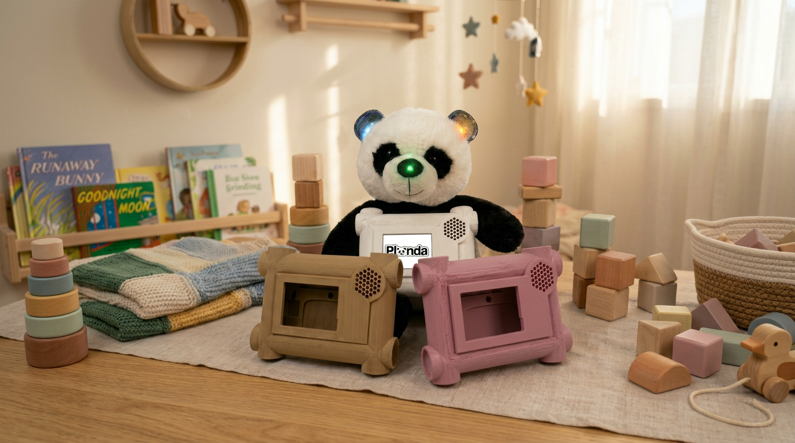

# Planda
Een interactieve knuffelbeer die kinderen op een speelse en zelfstandige manier helpt bij het aanleren van dagelijkse taakjes.

🛠️ Built by ``Doren Vermaut`` & ``Luna Van Tittelboom`` & ``Bram Eeckhout``    
🔥 Supervised by ``prof. dr. Bas Baccarne``, ``Yannick Christiaens`` & ``Wouter Devriese``    
🌱 Grown at ``Ghent University`` 🏛️ ``Industrial Design Engineering`` ([project overview](https://github.com/basbaccarne/human-centered-design))       

*11/06/2026*   

## Samenvatting
Veel jonge ouders ervaren dagelijks stress tijdens het aanleren van routinetaken aan jonge kinderen. Taken zoals tanden poetsen, handen wassen, naar het toilet gaan of de boekentas voorbereiden vragen vaak voortdurende begeleiding, herhaling en controle. Dit zorgt voor frustratie bij zowel ouder als kind en vermindert de zelfstandigheid van het kind.

Om dit probleem te onderzoeken, doorliepen we een iteratief human-centered designproces met interviews, observaties, storyboards, benchmarking, ergonomische analyses en verschillende testwaves met prototypes. Tijdens het eerste semester lag de focus op een plannings- en routine-instrument voor de ochtendroutine. Uit feedback en gebruikerstesten bleek echter dat een puur planningsgericht systeem minder geschikt was binnen de hectiek van de ochtend. Daarom evolueerde het concept naar een interactieve begeleidende knuffelbeer die kinderen pedagogisch ondersteunt bij het aanleren van dagelijkse taakjes.

De uiteindelijke oplossing bestaat uit een zachte interactieve knuffelbeer met een scherm op de buik waarop visuele stappenplannen worden weergegeven. Via knoppen in de oortjes navigeert het kind doorheen de taakjes, ondersteund door licht- en geluidsfeedback. De beer begeleidt kinderen stap voor stap op een speelse, intuïtieve en zelfstandige manier, waardoor ouders minder voortdurend moeten tussenkomen en opvoedingsstress vermindert.

## Introductie
Opvoeden brengt niet alleen plezier, maar ook veel stress met zich mee, zeker bij jonge ouders tijdens dagelijkse routines zoals tanden poetsen, handen wassen, aankleden of de boekentas voorbereiden. Veel kinderen hebben moeite om deze taken zelfstandig uit te voeren, waardoor ouders voortdurend moeten begeleiden, herhalen en controleren. Dit zorgt voor tijdsdruk, frustratie en gespannen interacties binnen het gezin.[^1] Onderzoek toont aan dat opvoedingsstress niet alleen een negatieve impact heeft op het welzijn van ouders, maar ook de zelfstandigheid en het zelfvertrouwen van kinderen kan beperken.

Het Planda Beer-project onderzoekt hoe een interactieve knuffelbeer kinderen pedagogisch kan begeleiden bij het aanleren van dagelijkse taakjes. In tegenstelling tot een klassiek planningsinstrument richt het concept zich op het stap voor stap ondersteunen van het kind via een speelse, fysieke en digitale interactie. De beer combineert een scherminterface met auditieve en visuele feedback, zoals geluid, LED-lichtjes en intuïtieve knopinteractie via de oortjes. Op deze manier wordt het kind zelfstandig begeleid zonder dat de ouder voortdurend actief moet tussenkomen.

Om tot deze oplossing te komen, werd een iteratief human-centered designproces doorlopen met interviews, observaties, storyboards, benchmarking, ergonomische analyses en meerdere prototypewaves. Hierbij werd onderzocht hoe kinderen reageren op licht, geluid, symbolen, feedback en fysieke interactie.

De boundary conditions van het project zijn duidelijk: het product moet veilig, zacht, robuust, intuïtief en kindvriendelijk zijn. Daarnaast mag de technologie geen extra stress creëren, maar net rust, autonomie en positieve interactie stimuleren.

## Inhoudstafel

1. [Methodologie](./docs/methodologie.md)
2. [Discovery](./docs/discovery.md)
3. [Definition](./docs/definition.md)
4. [Development 1](./docs/develop_1.md)
5. [Development 2](./docs/develop_2.md)
6. [Development 3](./docs/develop_3.md)
7. [Design Requirements](./docs/design_requirements.md)
8. [Bill of materials](./docs/bom.md)
9. [Conclusie](./docs/conclusie.md)

## Kritische reflectie
Het Planda‑project heeft over twee semesters heen een duidelijke en betekenisvolle evolutie doorgemaakt. Waar SEM1 vooral gericht was op het begrijpen van opvoedstress, kinderroutines en knuffelgedrag, lag de nadruk in SEM2 op het systematisch bouwen, testen en verfijnen van een interactief product dat zowel functioneel als emotioneel aansluit bij de leefwereld van jonge kinderen. Deze iteratieve aanpak heeft geleid tot een solide ontwerp, maar ook tot belangrijke inzichten over de beperkingen en uitdagingen van het project.

In SEM1 werd duidelijk dat een puur planningsgericht systeem onvoldoende aansluit bij de realiteit van gezinnen. De pivot naar een interactieve knuffelbeer was een cruciale stap: het toonde aan dat kinderen vooral reageren op fysieke, speelse en multisensorische prikkels. De Wizard‑of‑Oz‑testen en conceptual waves maakten zichtbaar hoe kinderen spontaan omgaan met licht, geluid en knuffelinteractie, en hoe belangrijk het is dat technologie zich aanpast aan hun natuurlijke gedrag in plaats van omgekeerd.

In SEM2 werd deze basis verder uitgediept. Develop 1 bracht de complexiteit van de functionele architectuur naar voren: het combineren van fysieke knoppen, visuele stappenplannen en auditieve feedback vraagt om een delicate balans tussen eenvoud en duidelijkheid. Develop 2 legde de nadruk op ergonomie en veiligheid. De antropometrische analyses en usabilitytests toonden aan dat kleine vormverschillen in de oortjes grote impact hebben op intuïtiviteit en comfort. Develop 3 richtte zich op UX en CMF, waarbij tactiliteit, materiaalkeuze en lichtdoorlaatbaarheid bepalend bleken voor de emotionele beleving van het product.

Toch blijven er kritische kanttekeningen. De steekproef blijft beperkt, waardoor sommige inzichten (zoals kleurassociaties of voorkeur voor oorknoppen) niet universeel gegarandeerd zijn. Daarnaast blijft de context van testen relatief gecontroleerd; echte ochtendstress is moeilijk te simuleren. Dit betekent dat gedrag dat in testsituaties voorspelbaar lijkt, in een chaotische ochtendroutine anders kan uitpakken.

Ook de vraag naar langdurige motivatie blijft open: blijven kinderen reageren op licht‑ en geluidsfeedback, of treedt gewenning op na enkele weken? Dit is essentieel, omdat het succes van Planda Beer afhangt van duurzame betrokkenheid. Tot slot introduceert het afneembare scherm praktische uitdagingen: hoewel ouders het waarderen, vormt het een extra handeling die in drukke routines snel vergeten kan worden. Dit vraagt om verdere vereenvoudiging of automatisering.

Daarnaast toont het project aan dat elke ontwerpkeuze een spanningsveld creëert: tussen knuffelbaarheid en functionaliteit, tussen autonomie en veiligheid, tussen eenvoud en veelzijdigheid. Het vinden van de juiste balans blijft een voortdurende uitdaging.

Ondanks deze beperkingen heeft het project een sterke methodologische basis gelegd. De combinatie van kwalitatieve observaties, iteratieve prototyping en empirische validatie heeft geleid tot een onderbouwd ontwerp dat rekening houdt met zowel kind als ouder. De kritische reflectie toont vooral dat Planda Beer potentieel heeft, maar dat verdere testen, grotere steekproeven en langdurige evaluaties noodzakelijk zijn om een product te creëren dat écht werkt in diverse gezinsomgevingen.

## Noot inzake het gebruik van AI
In dit project werd AI enkel als ondersteunend hulpmiddel gebruikt. We zetten AI in om enkele eigen schetsen netter te visualiseren, renders te maken, teksten vlotter te formuleren, en tabellen of schema’s overzichtelijk op te maken zodat ze makkelijk in Visual Studio Code konden worden geïmporteerd. Alle concepten, ontwerpen, analyses en beslissingen zijn volledig door het projectteam zelf ontwikkeld; AI werd uitsluitend ingezet voor vormgeving en taalondersteuning.

## Bijlagen
### Discovery
* Benchmarkonderzoek (N=14)
  * [Protocol](https://drive.google.com/file/d/1VPV1awJDa64VDqinm8LVtdigFpOs-lXI/view?usp=sharing)
  * [Rapport](https://drive.google.com/file/d/1ek-WHoF4-XrpG6pTKncxjXwMrDPfr108/view?usp=sharing)
* Interviews (N=3)
  * [Protocol](https://drive.google.com/file/d/1N_GjyhnOHkRdai5fe6EW2gFWemPGeeNa/view?usp=sharing)
  * [Rapport](https://drive.google.com/file/d/19u9PNdlWeaDVB6IC4Rpc8PkJ9rHKdnLq/view?usp=sharing)
    
### Definition
* User testing wave 1 (N=4)
  * [Protocol](https://drive.google.com/file/d/130vRvOUCvCWISH5MEXmbPGNB_Uw2ju9m/view?usp=drive_link)
  * [Rapport](https://drive.google.com/file/d/1wbh-eud349pPwJQK2OwwAVadwWI7WrDZ/view?usp=drive_link)
* User testing wave 2 (N=6)
  * [Protocol](https://drive.google.com/file/d/1jO9U5P_zEwsMB1liQGqoZsyC6XyTrukl/view?usp=drive_link)
  * [Rapport](https://drive.google.com/file/d/1y09vUGmh9ruJW8-vAtFctbpJqeW_Oqac/view?usp=drive_link)

### Development 1
* Literatuuronderzoek (N=11)
  * [Protocol](https://drive.google.com/file/d/1JkM7xMZF1cOWVq1P75I5-xc_WWrdSNv_/view?usp=sharing)
  * [Rapport](https://drive.google.com/file/d/1lqU_Gb7P2KewI6b2YRbHUHMy500uVC_5/view?usp=sharing)
* User testing (N=3)
  * [Protocol](https://drive.google.com/file/d/15MI33pND1JuIGdH_J8u2If2VXpHv9gB-/view?usp=sharing)
  * [Rapport](https://drive.google.com/file/d/1iAICvbYoYDdQVMLRW9RndhLdhfBj4c1h/view?usp=sharing)

### Development 2
* Antropometrie onderzoek
  * [Rapport](https://drive.google.com/file/d/1W2tFgDZaNar4k2NG-botPuARzz3v3zZD/view?usp=sharing)
* User testing (N=1)
  * [Protocol](https://drive.google.com/file/d/18UV0sOgIwRFaU0k2yumadGYeaR9zQ-xK/view?usp=sharing)
  * [Rapport](https://drive.google.com/file/d/10HXQ8sNEB7mYRsCe3yflU_DUqUeTnOM8/view?usp=sharing)

### Development 3
* User testing (N = 3)
  * [Protocol](https://drive.google.com/file/d/1nMEvOunnXXP05v1LXsKzn6qRlS9hDP_Y/view?usp=sharing)
  * [Rapport](https://drive.google.com/file/d/1Gyd1z_1kM8eNMYuMG_D5NSGw8vEMbcCc/view?usp=sharing)
  * [PowerPoint omhulsel](https://drive.google.com/file/d/1jtBIYcoHiLNUWgVYdP9SYzcHUyG76-D9/view?usp=sharing)
  * [PowerPoint oortjes](https://drive.google.com/file/d/1XNqXtDPErmhQJFLdnw9bNmKRSQDc-u7y/view?usp=sharing)

## Licentie  

This repository contains both software and design materials created as part of an industrial design energineering project at Ghent University.

- **Software and code:** [MIT License](./LICENSE-MIT)  
- **Design, documentation, CAD, and media:** [CC BY 4.0 License](./LICENSE)
  
You are free to reuse and build upon this work, both commercially and non-commercially, as long as proper attribution is given to the original authors.

## Bronnen
[^1]: Persoonlijk interview met Sofie, 18 oktober 2025; persoonlijk interview met Ludovic, 19 oktober 2025; persoonlijk interview met Kaat, 19 oktober 2025.