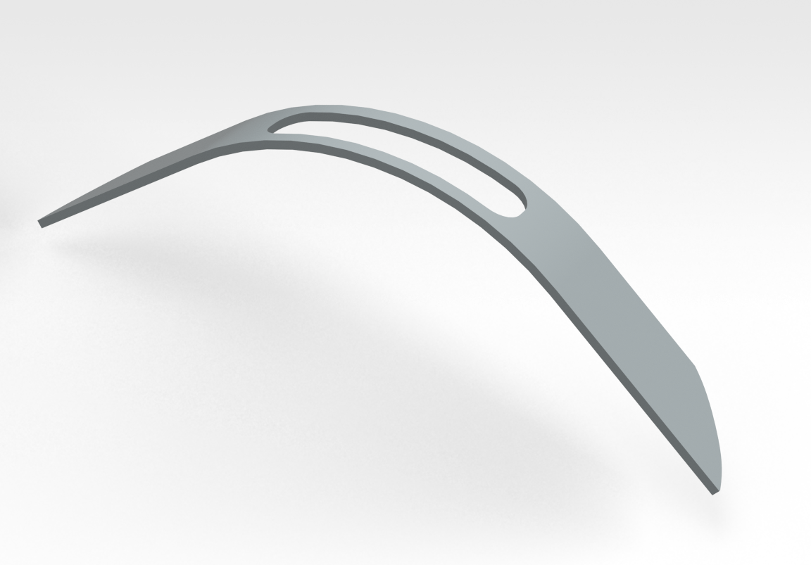
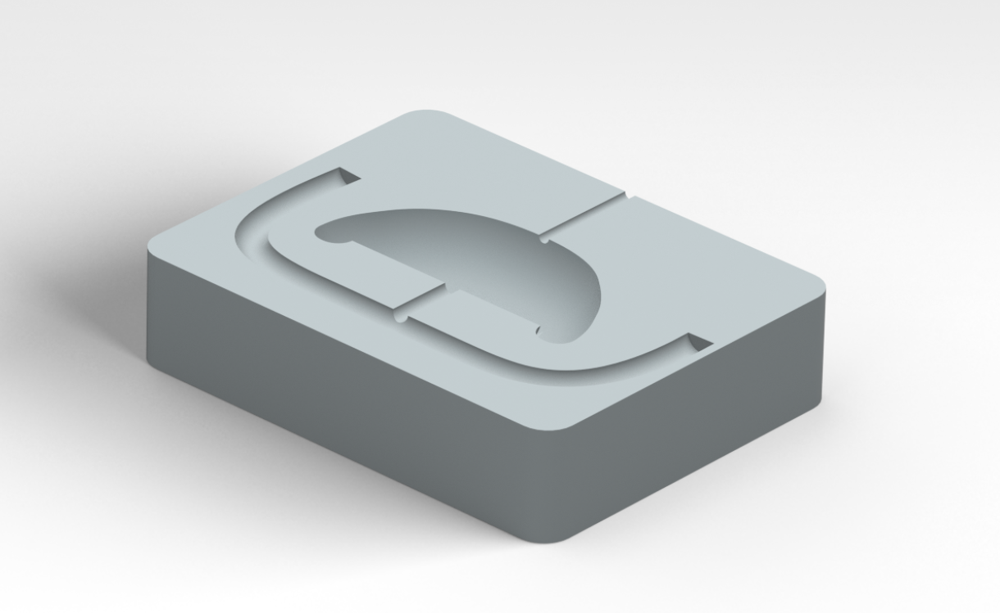
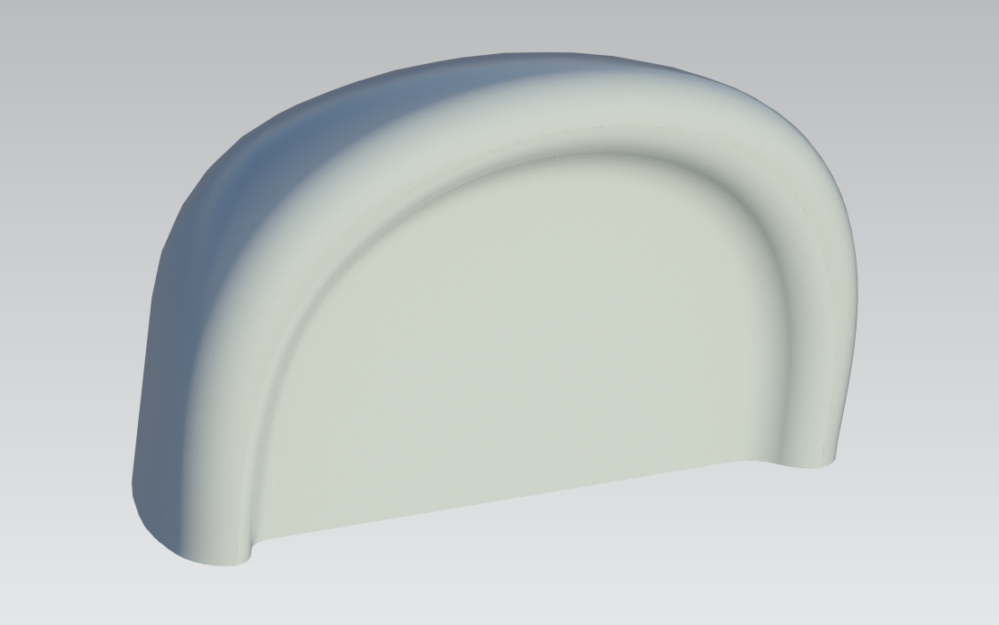

Voor ons project hebben we de oortjes van de bestaande beer herontworpen zodat ze kunnen functioneren als drukknoppen.

Hiervoor hebben we de oortjes ontworpen in CAD en vervolgens een mal ontwikkeld waarmee de oortjes gerealiseerd konden worden door silicone in de mal te gieten.

Om de oortjes stevig aan de beer te bevestigen, hebben we daarnaast een bevestigingsboog ontworpen. De oortjes worden op deze boog vastgelijmd, waarna de volledige constructie onder de vacht van de beer wordt geplaatst.

**Bevestegingsboog**

CAD-bestand: [bevestigingsboog.prt](<../../../../OneDrive - UGent/Bestanden van Bram Eeckhout - Project GO - Team 4/Cad files/planda oortje/bevestegingsboog.prt>)

**Mal oortje**

CAD-bestand: [mal.prt](<../../../../OneDrive - UGent/Bestanden van Bram Eeckhout - Project GO - Team 4/Cad files/planda oortje/mal.prt>)

**Oortje**

CAD-bestand: [oortjes.prt](<../../../../OneDrive - UGent/Bestanden van Bram Eeckhout - Project GO - Team 4/Cad files/planda oortje/oortjes eerste versie - kopie - kopie.prt>)
