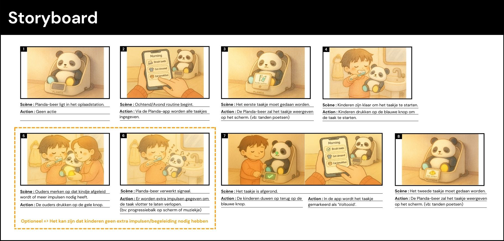

## Definition
### Doestellingen
Het hoofddoel van dit project is het ontwikkelen van een slim hulpmiddel dat de ochtendroutine voor gezinnen met jonge kinderen (2-6 jaar) verlicht. Het ontwerpproces is opgedeeld in verschillende waves om iteratief te testen en te verbeteren.

> **Wave 1**
>
>Inzicht krijgen in de huidige routines van gezinnen en eerste feedback verzamelen op low-fidelity prototypes en storyboards. De focus lag hierbij op hoe kinderen hun knuffel gebruiken en hoe ontwerpkeuzes de interactie beïnvloeden.

> **Wave 2**
> Het optimaliseren van de fysieke materialen en de interactievormen. Specifiek werd onderzocht hoe impulsen (licht/geluid) en beloningen de motivatie van het kind beïnvloeden en welke kleuren/materialen het gebruiksgemak verhogen.

### Materiaal & methoden
Het storyboard werd in een vroege fase opgesteld om de context en het gebruik van Planda tijdens de ochtendroutine te verduidelijken. Door de interactie tussen kind, ouder en knuffelbeer stap voor stap te visualiseren, werd duidelijk wanneer en hoe het product gebruikt wordt en welke acties, feedback en begeleiding daarbij nodig zijn.

Uit het storyboard kwamen verschillende aandachtspunten naar voren, zoals de rol van de ouder, het belang van duidelijke start- en eindmomenten van taakjes en de nood aan extra impulsen wanneer de aandacht van het kind verslapt. Deze inzichten vormden de basis voor het opzetten van de onderzoeks-waves.

Op basis van het storyboard werd beslist om het onderzoek gefaseerd aan te pakken: eerst door te focussen op fysieke interactie en intuïtief gebruik, en daarna op verfijning van feedback, materialen en bediening. De prototypes werden telkens opgebouwd rond specifieke momenten uit het storyboard en getest in een realistische context via observaties bij kinderen en interviews met ouders. Op die manier fungeerde het storyboard als leidraad voor zowel het onderzoek als de analyse in de verschillende waves.

Het onderzoek werd uitgevoerd via interviews, observaties en praktijktesten bij gezinnen thuis. Er namen ouders en kinderen tussen 2 en 6 jaar deel. In beide waves werden prototypes getest tijdens gesimuleerde ochtendroutines.

Het hoofddoel van het ontwerp is dat kinderen de routine kunnen doorlopen met minimale of geen assistentie van de ouders. Om deze hoge graad van intuïtiviteit te bereiken, hebben we ons ontwikkelproces gebaseerd op de 7 Stages of Action van Donald Norman.

Bij elk prototype hebben we geanalyseerd hoe het kind de brug slaat tussen hun doel (bijv. "ik moet mijn tanden poetsen") en de fysieke handeling.

Om de interactie tussen kind en de Planda-beer te optimaliseren, gebruikten we de Wizard of Oz-methode waarbij we o.a. handmatig licht en geluid aanstuurden. Hierdoor leek de beer autonoom te reageren, wat essentieel was om de intuïtiviteit te testen volgens de 7 Stages of Action van Norman.

### Resultaten
**Wave 1: User feedback sessions (N=5)**

De meeste kinderen ervaren de ochtendroutine als een moment van afleiding, waarbij de focus op taken zoals tanden poetsen of aankleden snel verloren gaat. Ouders beschouwen hun constante sturing als een noodzaak om de tijdslimiet te halen, wat leidt tot een sfeer van stress.

"Ik merk dat ik 's ochtends alleen maar commando's aan het uitdelen ben. Dat is geen fijne manier om de dag te starten, noch voor mij, noch voor de kinderen." - Jolien, mama van Emiel en Lowie

In de eerste testen werd er getest hoe we informatie kunnen overbrengen naar de kinderen. Er werd onderzocht welke manieren het beste te begrijpen zijn voor hen, door zowel fysieke objecten als een scherm te gebruiken. 

Uit de resultaten bleek dat het scherm het meest effectief was om de taakjes over te brengen. Daarnaast merkten we dat kinderen na de ochtendroutine de knuffel ook vrij willen gebruiken om mee te spelen. Dit betekent dat het scherm op de beer gemonteerd moet kunnen worden om de taakjes uit te voeren, maar dat het daarna eenvoudig verwijderd kan worden zodat de kinderen vrij kunnen spelen.

Naast het overdragen van informatie werden ook de interactieve elementen van de beer getest. Hierbij werd gekeken naar welke onderdelen kinderen het liefst aanraken, hoe de interactie verloopt en waar de elementen het beste geplaatst kunnen worden. De testen richtten zich op de oren, armen en voeten van de beer. Hieruit bleek dat kinderen spontaan op de oren drukken, terwijl de handen en voeten problematisch zijn omdat kinderen de beer daar vaak vasthouden. Dit voorkomt onbedoelde input.

Tot slot werd onderzocht hoe kinderen interacteren met hun eigen knuffels, om hieruit inzichten te halen voor het ontwerp van de interactieve beer.

**Wave 2: User feedback sessions (N=5)**

In de tweede fase lag de focus op de verfijning van de signalen en de kleurassociaties. De cognitieve verwerking van prikkels verschilt per kind; waar de één direct reageert op licht, heeft de ander een auditieve trigger nodig om in actie te komen. 

De resultaten tonen aan dat een enkelvoudige prikkel (alleen licht) vaak wordt gemist. De combinatie van geluid en licht bleek de meest krachtige oplossing. Het geluid fungeert als aandachtstrekker, terwijl het lampje in het oor de exacte actieplaats aanwijzen.

Er werd een test uitgevoerd om te onderzoeken hoe kinderen van verschillende leeftijden kleuren associëren met emoties. Kinderen moesten emoties koppelen aan kleuren.

De autonomie van het kind wordt versterkt door deze directe feedbacklus. De beer fungeert als een onafhankelijke gids, waardoor de ouderlijke rol verschuift van sturende "politieagent" naar toeschouwer, wat de opvoedstress aanzienlijk verlaagt.

### Conclusies & implicaties
Op basis van de onderzoeksresultaten en gebruikerstesten werd een set concrete design requirements opgesteld. Deze vormen het fundament voor de verdere ontwikkeling van het product en vertalen de inzichten uit het ontwerpproces naar duidelijke functionele en ergonomische ontwerprichtlijnen.

> [!IMPORTANT]
> **Design Requirements**
> - 1.6 Het product moet makkelijk door de doelgroep vast te houden zijn.	
> - 1.7 Het product moet het knuffelaspect behouden.
> - 1.8 Het product moet (deels) wasbaar zijn.
> - 2.1 Het scherm moet losneembaar zijn.
> - 3.1	Het product moet knoppen hebben.
> - 3.2	De knoppen moeten op een toegankelijke plaats gepositioneerd worden.
> - 1.9 Het product moet feedback geven aan de gebruiker.	
> - 3.3	Het licht moet aantonen welke knop er ingeduwd moet worden.
> - 3.4	De kleuren van het licht moeten duidelijkheid geven.	
> - 4.1	De aandacht van het kind moet getrokken worden a.d.h.v. geluid.

