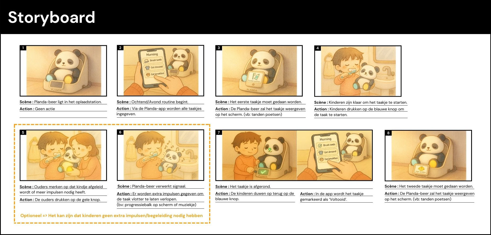

## Definition

### Doelstellingen
Het hoofddoel van dit project is het ontwikkelen van een slim hulpmiddel dat de ochtendroutine voor gezinnen met jonge kinderen (2-6 jaar) verlicht. Het ontwerpproces is opgedeeld in verschillende waves om iteratief te testen en te verbeteren.

> **Wave 1**
>
>Inzicht krijgen in de huidige routines van gezinnen en eerste feedback verzamelen op low-fidelity prototypes en storyboards. De focus lag hierbij op hoe kinderen hun knuffel gebruiken en hoe ontwerpkeuzes de interactie beïnvloeden.

> **Wave 2**
>
> Het optimaliseren van de fysieke materialen en de interactievormen. Specifiek werd onderzocht hoe impulsen (licht/geluid) en beloningen de motivatie van het kind beïnvloeden en welke kleuren/materialen het gebruiksgemak verhogen.

---

### Materiaal & methoden
Het storyboard werd in een vroege fase opgesteld om de context en het gebruik van Planda tijdens de ochtendroutine te verduidelijken. Door de interactie tussen kind, ouder en knuffelbeer stap voor stap te visualiseren, werd duidelijk wanneer en hoe het product gebruikt wordt en welke acties, feedback en begeleiding daarbij nodig zijn.

Uit het storyboard kwamen verschillende aandachtspunten naar voren, zoals de rol van de ouder, het belang van duidelijke start- en eindmomenten van taakjes en de nood aan extra impulsen wanneer de aandacht van het kind verslapt. Deze inzichten vormden de basis voor het opzetten van de onderzoeks-waves.

Op basis van het storyboard werd beslist om het onderzoek gefaseerd aan te pakken: eerst door te focussen op fysieke interactie en intuïtief gebruik, en daarna op verfijning van feedback, materialen en bediening. De prototypes werden telkens opgebouwd rond specifieke momenten uit het storyboard en getest in een realistische context via observaties bij kinderen en interviews met ouders. Op die manier fungeerde het storyboard als leidraad voor zowel het onderzoek als de analyse in de verschillende waves.

Het onderzoek werd uitgevoerd via interviews, observaties en praktijktesten bij gezinnen thuis. Er namen ouders en kinderen tussen 2 en 6 jaar deel. In beide waves werden prototypes getest tijdens gesimuleerde ochtendroutines.

De protocollen voor de interviews van beide waves zijn hier te vinden:
* [Protocol wave 1](https://drive.google.com/file/d/130vRvOUCvCWISH5MEXmbPGNB_Uw2ju9m/view?usp=drive_link)
* [Protocol wave 2](https://drive.google.com/file/d/1jO9U5P_zEwsMB1liQGqoZsyC6XyTrukl/view?usp=drive_link)

Het hoofddoel van het ontwerp is dat kinderen de routine kunnen doorlopen met minimale of geen assistentie van de ouders. Om deze hoge graad van intuïtiviteit te bereiken, hebben we ons ontwikkelproces gebaseerd op de 7 Stages of Action van Donald Norman.

Bij elk prototype hebben we geanalyseerd hoe het kind de brug slaat tussen hun doel (bijv. "ik moet mijn tanden poetsen") en de fysieke handeling.

Om de interactie tussen kind en de Planda-beer te optimaliseren, gebruikten we de Wizard of Oz-methode waarbij we o.a. handmatig licht en geluid aanstuurden. Hierdoor leek de beer autonoom te reageren, wat essentieel was om de intuïtiviteit te testen volgens de 7 Stages of Action van Norman.

---

### Resultaten

**Wave 1: User feedback sessions (N=5)**

De meeste kinderen ervaren de ochtendroutine als een moment van afleiding, waarbij de focus op taken zoals tanden poetsen of aankleden snel verloren gaat. Ouders beschouwen hun constante sturing als een noodzaak om de tijdslimiet te halen, wat leidt tot een sfeer van stress.

In de eerste testen werd er getest hoe we informatie kunnen overbrengen naar de kinderen. Er werd onderzocht welke manieren het beste te begrijpen zijn voor hen, door zowel fysieke objecten als een scherm te gebruiken. 

Uit de resultaten bleek dat het scherm het meest effectief was om de taakjes over te brengen. Daarnaast merkten we dat kinderen na de ochtendroutine de knuffel ook vrij willen gebruiken om mee te spelen. Dit betekent dat het scherm op de beer gemonteerd moet kunnen worden om de taakjes uit te voeren, maar dat het daarna eenvoudig verwijderd kan worden zodat de kinderen vrij kunnen spelen.

Naast het overdragen van informatie werden ook de interactieve elementen van de beer getest. Hierbij werd gekeken naar welke onderdelen kinderen het liefst aanraken, hoe de interactie verloopt en waar de elementen het beste geplaatst kunnen worden. De testen richtten zich op de oren, armen en voeten van de beer. Hieruit bleek dat kinderen spontaan op de oren drukken, terwijl de handen en voeten problematisch zijn omdat kinderen de beer daar vaak vasthouden. Dit voorkomt onbedoelde input.

Tot slot werd onderzocht hoe kinderen interacteren met hun eigen knuffels, om hieruit inzichten te halen voor het ontwerp van de interactieve beer.

Het report van de interviews is [hier](https://drive.google.com/file/d/1wbh-eud349pPwJQK2OwwAVadwWI7WrDZ/view?usp=sharing) te vinden.

**Wave 2: User feedback sessions (N=5)**

In de tweede fase lag de focus op de verfijning van de signalen en de kleurassociaties. De cognitieve verwerking van prikkels verschilt per kind; waar de één direct reageert op licht, heeft de ander een auditieve trigger nodig om in actie te komen. 

De resultaten tonen aan dat een enkelvoudige prikkel (alleen licht) vaak wordt gemist. De combinatie van geluid en licht bleek de meest krachtige oplossing. Het geluid fungeert als aandachtstrekker, terwijl het lampje in het oor de exacte actieplaats aanwijzen.

Er werd een test uitgevoerd om te onderzoeken hoe kinderen van verschillende leeftijden kleuren associëren met emoties. Kinderen moesten emoties koppelen aan kleuren.

Kinderen zien links vaak als “terug” en rechts als “doorgaan”. Daarom is het logisch om rechts te gebruiken voor het starten en links voor beëindigen, zo wordt het makkelijker en duidelijker voor hen.

De autonomie van het kind wordt versterkt door deze directe feedbacklus. De beer fungeert als een onafhankelijke gids, waardoor de ouderlijke rol verschuift van sturende "politieagent" naar toeschouwer, wat de opvoedstress aanzienlijk verlaagt.

Het report van de interviews is [hier](https://drive.google.com/file/d/1y09vUGmh9ruJW8-vAtFctbpJqeW_Oqac/view?usp=sharing) te vinden.

---

### Aanvullende tekst voor de Definition-fase

In tegenstelling tot de 7 Stages of Action, die eerder te algemeen bleken voor deze doelgroep, waren signifiers en constraints veel relevanter voor het ontwerp van een knuffel voor kinderen van 2 tot 6 jaar. Kinderen in deze leeftijdsgroep handelen voornamelijk op basis van directe visuele en fysieke aanwijzingen, waardoor het ontwerp sterk hierop werd afgestemd.

Er werd daarbij ingezet op drie kernprincipes. Ten eerste signifiers, waarbij licht in het oor aangeeft waar actie verwacht wordt, kleurgebruik betekenis communiceert (geel = start, groen = voltooid) en duidelijke iconen op het scherm de interactie ondersteunen. Ten tweede physical constraints, waarbij knoppen uitsluitend op de oren werden geplaatst omdat andere lichaamsdelen (armen, voeten en romp) tijdens het spelen vaak worden vastgehouden, wat onbedoelde input zou veroorzaken. Ten derde logical constraints, waarbij rechts staat voor verder en links voor terug, gebaseerd op natuurlijke links-rechtsassociaties die in Wave 2 werden bevestigd.

Daarnaast werd in deze fase expliciet rekening gehouden met de mentale modellen van jonge kinderen. Kinderen begrijpen technologie niet zoals volwassenen, maar redeneren vanuit herkenbare patronen zoals: 
> *“Als iets licht geeft, moet ik daar iets doen.”*

> *“Als ik op een oor druk, gebeurt er iets met de beer.”* 

> *“Rechts is vooruit, links is terug.”*

Door deze mentale modellen te analyseren en te vertalen naar concrete interacties, werd de beer voorspelbaar en begrijpelijk gemaakt, wat een cruciale voorwaarde vormt voor autonomie bij jonge gebruikers.

---

### Conclusies & implicaties
Op basis van het onderzoek en de gebruikerstesten zijn design requirements opgesteld. Deze zijn gebaseerd op de onderstaande tabel met conclusies en bijhorende redenen. Ze vormen de basis voor het verdere ontwerp en vertalen de inzichten naar duidelijke richtlijnen voor functie en gebruiksgemak, zodat het eindproduct aansluit bij de behoeften van de gebruikers.

| Conclusie | Reden uit onderzoek |
|-----------|--------------------|
| Het product moet zowel licht- als geluidssignalen gebruiken. | In wave 2 bleek dat een enkelvoudige prikkel vaak gemist wordt. De combinatie van geluid en licht trok de aandacht van kinderen het meest effectief. |
| Het scherm moet eenvoudig verwijderd kunnen worden van de knuffel. | Kinderen gaven aan dat ze na de routine verder willen spelen met de knuffel. Een losneembaar scherm zorgt ervoor dat de beer ook als gewone knuffel gebruikt kan worden. |
| Interactie gebeurt via fysieke knoppen op de beer. | Tijdens de testen bleek dat jonge kinderen spontaan fysieke onderdelen van de knuffel aanraken en indrukken. Dit sluit beter aan bij hun motorische vaardigheden dan abstracte digitale bediening. |
| De knoppen worden geplaatst op locaties die gemakkelijk bereikbaar zijn voor kinderen. | Uit observaties bleek dat kinderen de oren spontaan aanraken, terwijl handen en voeten vaak worden vastgehouden tijdens het spelen. |
| De functies van de knoppen moeten overeenkomen met de verwachtingen van kinderen. | Kinderen associëren rechts spontaan met verdergaan en links met teruggaan of stoppen. |
| De actieve knop wordt verlicht. | Tijdens wave 2 bleek dat lichtsignalen kinderen helpen begrijpen waar een actie verwacht wordt. |
| De gekozen kleuren moeten aansluiten bij de betekenis die kinderen eraan geven. | Onderzoek naar kleur-emotieassociaties toonde aan dat kinderen kleuren koppelen aan bepaalde gevoelens en acties, waardoor kleuren betekenisvol kunnen worden ingezet. |
| Geluid wordt gebruikt als aandachtstrekker tijdens de routine. | Uit de testen bleek dat licht alleen niet altijd wordt opgemerkt. Geluid helpt om de aandacht opnieuw naar de taak te brengen. |
| Het product moet herkenbaar blijven als knuffel en uitnodigen tot spelen. | Kinderen hechtten veel belang aan het knuffelkarakter en wilden de beer ook buiten de ochtendroutine gebruiken. |
| De vorm moet afgestemd zijn op het gebruik door jonge kinderen. | Observaties toonden aan dat kinderen de knuffel op verschillende manieren vasthouden tijdens het spelen en gebruiken. |
| Het ontwerp moet onderhoudsvriendelijk zijn, bijvoorbeeld via een afneembare en wasbare hoes of onesie. | Omdat het product dagelijks gebruikt wordt door jonge kinderen, is hygiëne belangrijk. Een verwijderbare buitenlaag maakt reiniging mogelijk zonder de elektronica te beschadigen. |

> [!IMPORTANT]
> **Design Requirements**
> - 1.4 Het product geeft visuele en auditive feedback aan de gebruiker.
> - 1.5 Het scherm is losneembaar van het hoofdproduct.	
> - 2.2	Het product beschikt over fysieke knoppen.
> - 2.3	De knoppen zijn ergonomische en toegankelijke gepositioneerd voor de doelgroep.
> - 2.4 De knoppen zijn op een logische manier t.o.v. elkaar gepositioneerd.
> - 2.5	Lichtsignalen geven aan welke knop er moet ingeduwd worden.
> - 2.6	De kleuren van de lichtsignalen zorgen voor een duidelijke interpretatie.	
> - 2.7	Het product gebruikt geluid om de aandacht van het kind te trekken.
> - 3.2 Het product behoudt het knuffelaspect.
> - 3.3 Het product heeft een ergonomische vorm die makkelijk vast te houden is door de doelgroep.	
> - 3.4 Het product bevat onderdelen die gereinigd kunnen worden.