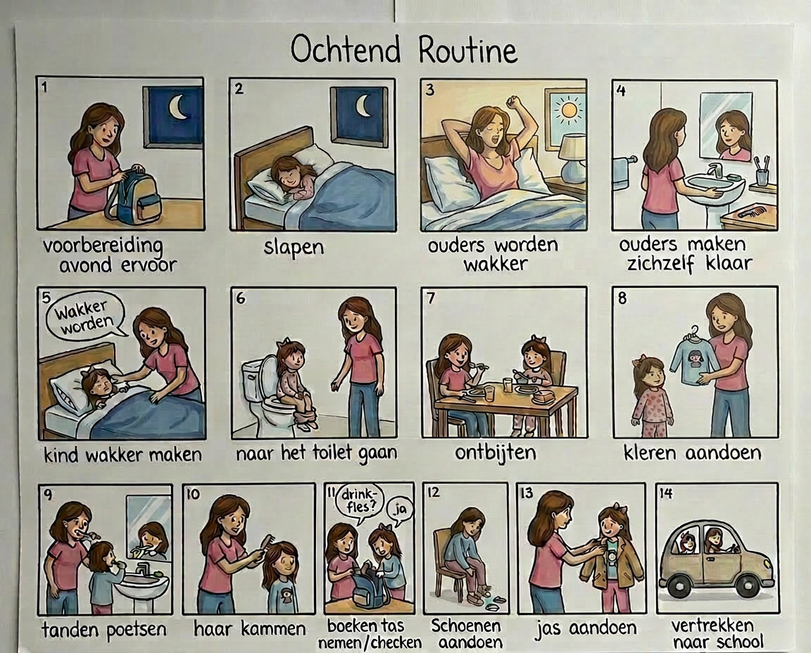
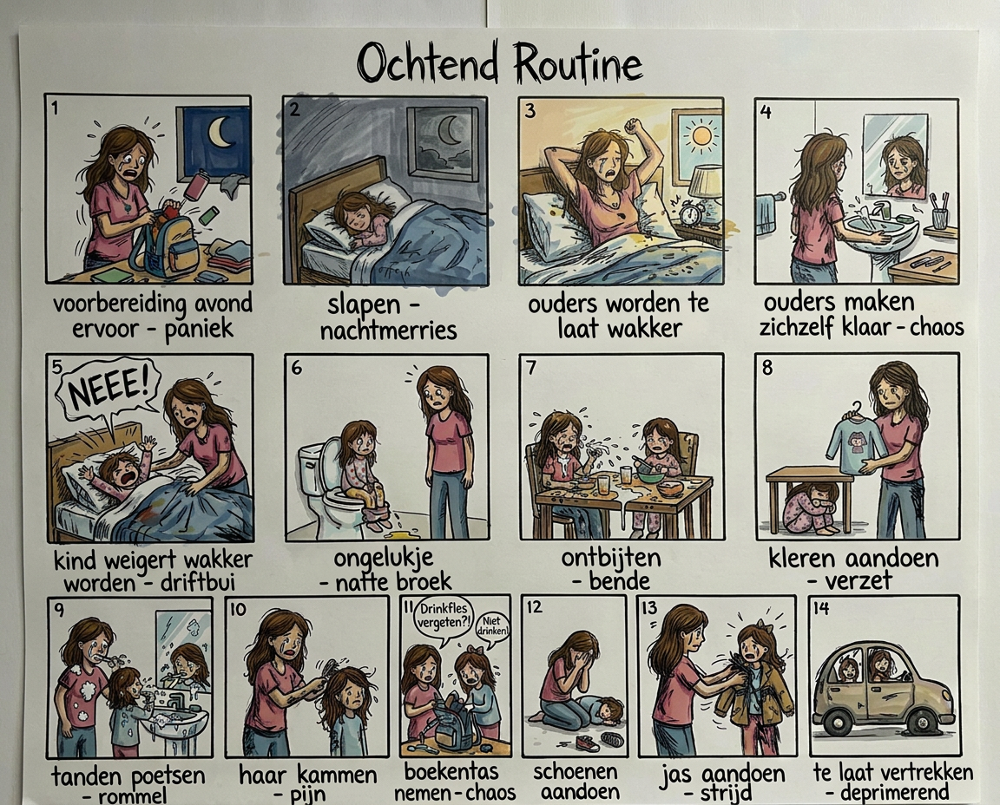
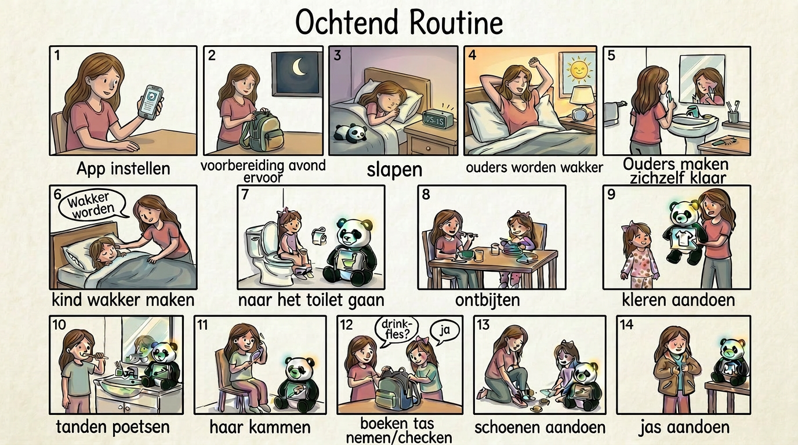
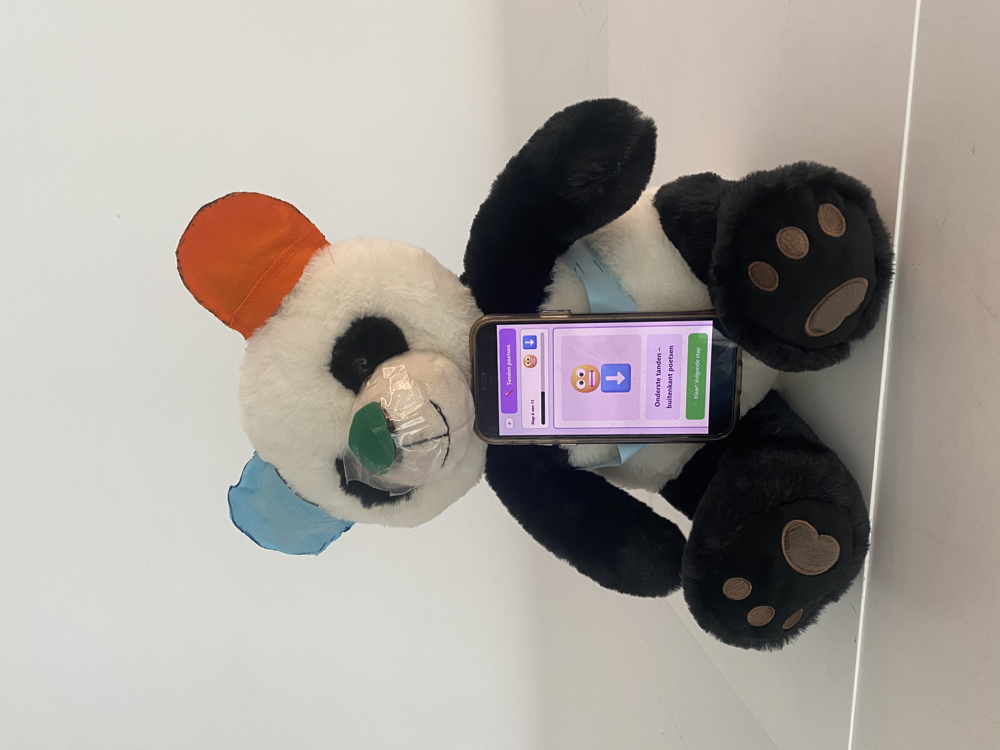

## Development 1

### Doelstellingen
Het hoofddoel van de eerste develop-fase was het verkennen van de mogelijkheden voor het product, met de volgende deeldoelen: inzicht krijgen in de ontwikkeling van kinderen, onderzoeken hoe zij interageren met de interface van de beer, mogelijke ontwerpen van de bijbehorende app verkennen, en bepalen hoe het product gerealiseerd kan worden.

---

### Materiaal & methoden
Voordat de interviews en literatuuronderzoek konden starten, werd eerst een functionele analyse uitgevoerd. In dit proces werd een verbeterde en meer gedetailleerde versie van het storyboard gemaakt om te onderzoeken wat de verschillende stappen zijn die met en zonder het product doorlopen worden. 

In onderstaand storyboard wordt er een ideale ochtendroutine voorgesteld.

Aangezien de ochtend niet altijd soepel verloopt, wordt hier ook een worst-case variant van gemaakt.

In onderstaand storyboard is dan te zien waar Planda kan worden ingezet.

Daarna werd er een literatuuronderzoek uitgevoerd om de ontwikkeling van een kind beter te begrijpen. Hierbij werd onderzoek gedaan naar de verschillende domeinen : motorisch, cognitief, sociaal-emotioneel en taalontwikkeling. Informatie kwam uit openbare bronnen, zoals websites, blogs en academisch onderzoek. Vervolgens werd de informatie vergeleken, zodanig dat er een tijdlijn van kon gemaakt worden. 

Het protocol voor het literatuuronderzoek is [hier](https://drive.google.com/file/d/1JkM7xMZF1cOWVq1P75I5-xc_WWrdSNv_/view?usp=sharing) te vinden.

Tijdens de testen van de interactieve beer werd een Wizard of Oz-opstelling gebruikt. Hierbij fungeerde een fysieke knuffelbeer als tastbare interface, terwijl een smartphone op de buik het Figma-prototype toonde. Via een Bluetooth-muis werden de schermen op afstand bestuurd, zodat de volledige interactiestroom getest kon worden zonder dat de echte hardware en software al ontwikkeld waren. De focus van de test lag vooral op het gedrag, begrip en de motivatie van kinderen tijdens dagelijkse zelfzorgtaken zoals handen wassen.

Daarna werden de noden voor de app onderzocht. Eerst werd aan de geïnterviewden gevraagd wat zij van de app verwachtten. Vervolgens werd een eerste versie van de app getoond en werd gevraagd welke functies of aanpassingen volgens hen nog ontbraken. 

De eerste versie van de app is hier te vinden: [Planda App](https://www.figma.com/make/4M9PoDPEkh4jKd4S3BSqR9/Planda-App-V1?fullscreen=1&t=7Io5MF27VStgSLxI-1&code-node-id=0-9)

Het protocol voor de interview-testen is [hier](https://drive.google.com/file/d/15MI33pND1JuIGdH_J8u2If2VXpHv9gB-/view?usp=sharing) te vinden.

---

### Resultaten
#### Literatuuronderzoek 
Uit dit onderzoek wordt duidelijk waarom gekozen werd voor de doelgroep van 2 tot 6 jaar. In deze periode maken kinderen een sterke ontwikkeling door. Ze zijn nieuwsgierig naar de wereld om zich heen, leren steeds zelfstandiger te worden en bouwen hun sociale vaardigheden verder uit. Tegelijk zetten ze hun eerste stappen in het kleuteronderwijs. Omdat in deze jaren de basis wordt gelegd voor hun verdere ontwikkeling, is het belangrijk om deze leeftijdsgroep goed in kaart te brengen.

Bijgevolg zijn volgende tijdlijnen ontstaan waarbij telkens één domein wordt bekeken.

Het report van het literatuuronderzoek is [hier](https://drive.google.com/file/d/1lqU_Gb7P2KewI6b2YRbHUHMy500uVC_5/view?usp=sharing) te vinden.

#### Testinterviews
**Analyse van gebruikerstesten met de interactieve beer**

Uit de testen kwamen verschillende belangrijke inzichten naar voren. Zo bleek dat kinderen verschillende niveaus van begeleiding nodig hebben. Beginners hebben nood aan een gedetailleerd stappenplan met kleine, duidelijke stappen, terwijl kinderen met meer ervaring sneller willen werken. Het systeem moet daarom adaptief zijn en begeleiding kunnen aanpassen aan het niveau van het kind. Daarnaast werd duidelijk dat de interactie soms plaatsvindt in een natte omgeving, waardoor het moeilijk kan zijn om knoppen te bedienen. Daarom is het belangrijk dat de interface waterbestendig en makkelijk schoon te maken is.

Verder bleek dat duidelijke en concrete instructies belangrijk zijn. Te complexe pictogrammen of te veel visuele elementen kunnen verwarrend zijn voor jonge kinderen. Tot slot toonde de test aan dat audiofeedback een grote meerwaarde heeft. Wanneer instructies werden voorgelezen, reageerden kinderen sneller en met meer zekerheid. Audio is daarom essentieel, zeker omdat kinderen in deze leeftijdsgroep vaak nog niet kunnen lezen. Positieve geluidjes en bevestigingen kunnen daarnaast helpen om kinderen gemotiveerd en betrokken te houden. 

**Analyse van de app-interface**

Uit de evaluatie blijkt dat ouders vooral belang hechten aan een eenvoudige, duidelijke en overzichtelijke app. De app moet snel en intuïtief werken, zodat ouders gemakkelijk taken kunnen instellen of aanpassen zonder door complexe menu’s te moeten navigeren. Daarnaast vinden ouders het belangrijk dat routines flexibel aangepast kunnen worden. Vooraf ingestelde taken zoals kleren aandoen, handen wassen of naar het toilet gaan zijn handig, maar ouders willen ook zelf taken kunnen toevoegen en de volgorde ervan aanpassen. Het is bovendien nuttig dat routines opgeslagen kunnen worden, zodat ze later snel opnieuw gebruikt kunnen worden.

Voor gezinnen met meerdere kinderen is het belangrijk dat meerdere accounts mogelijk zijn, zodat de gegevens en voortgang per kind overzichtelijk blijven. Ook moet de app toegankelijk zijn op meerdere smartphones, zodat beide ouders de verbinding met de knuffelbeer kunnen maken en de vooruitgang kunnen opvolgen. Ouders willen daarnaast de voortgang van hun kind kunnen volgen, bijvoorbeeld via visuele feedback zoals sterretjes, badges of een voortgangsbalk, en via een overzicht op langere termijn.

Verder kan het motiverend zijn wanneer kinderen zelf betrokken worden, bijvoorbeeld door de volgorde van taken te kiezen of hun voortgang op de beer te zien. Ook meldingen en tips worden als nuttig beschouwd, omdat ze ouders helpen om oefenmomenten niet te vergeten en ondersteuning bieden bij het oefenen. Tot slot moet de app duidelijk tonen of de knuffelbeer correct verbonden is en of de ingestelde routine goed is doorgestuurd, zodat ouders zeker zijn dat het systeem correct werkt.

Het report van de testinterviews is [hier](https://drive.google.com/file/d/1iAICvbYoYDdQVMLRW9RndhLdhfBj4c1h/view?usp=sharing) te vinden.

---

### Hardware en opstelling
Onderstaand schema geeft de uiteindelijke hardware-opstelling weer die gebruikt zal worden voor de realisatie van dit project. Op basis van deze opstelling werden de nodige componenten geselecteerd en aangekocht. In de volgende fase wordt de hardware opgebouwd en wordt de software ontwikkeld om het volledige systeem te testen.

Binnen dit project worden de taakjes en bijhorende hints opgeslagen in het interne geheugen van de ESP32. Hierdoor blijft het aantal beschikbare taakjes voorlopig beperkt door de opslagcapaciteit van de microcontroller. Het gebruikte TFT-display beschikt echter over een ingebouwde SD-kaartinterface. In een toekomstige uitbreiding kan deze opslagmogelijkheid gebruikt worden om de taakjes en hints extern op te slaan, waardoor een groter aantal taakjes mogelijk wordt.

In de huidige opstelling wordt een pogo-pin connector gebruikt om de verbinding tussen de ESP32 en de componenten in de beer tot stand te brengen. Dankzij de sterke magneten in deze connector kan de aansluiting niet verkeerd gepositioneerd worden, waardoor het omwisselen van de polariteit wordt voorkomen. Daarnaast maakt de magnetische verbinding het mogelijk om de aansluiting snel te koppelen en los te maken.

Omdat het solderen van dergelijke verbindingen extra nauwkeurigheid vereist en mijn ervaring hierin beperkt is, wordt in deze projectfase een eenvoudige zelfgemaakte connector gebruikt op basis van Dupont-kabels. Deze oplossing maakt het mogelijk om de hardware flexibel aan te sluiten en eenvoudig aanpassingen uit te voeren tijdens het ontwikkelproces.

---

### Conclusies & implicaties
Uit de testen blijkt dat het concept goed werkt, maar dat enkele onderdelen nog verder verbeterd moeten worden. Zo is adaptieve begeleiding nodig afhankelijk van het niveau van het kind, zijn waterbestendige knoppen belangrijk in natte situaties en speelt audio een grote rol omdat jonge kinderen vaak nog niet kunnen lezen. 

Daarnaast blijkt dat ouders een eenvoudige en overzichtelijke app willen. Ze willen routines makkelijk kunnen instellen en aanpassen en de voortgang van hun kind kunnen volgen via visuele feedback. 

In onderstaande tabel worden de conclusies weergegeven met de bijhorende reden of onderbouwing waarop de design requirements gebaseerd zijn.

| Conclusie | Reden |
|-----------|-------|
| Het systeem moet minimaal twee begeleidingsniveaus hebben en zich aanpassen aan het kind | Beginners hebben nood aan stap-voor-stap begeleiding, terwijl gevorderde kinderen sneller willen werken |
| Elke stap moet visueel eenvoudig en beperkt tot één actie zijn | Kinderen raken verward door complexe pictogrammen en te veel visuele elementen |
| Audio-instructies zijn essentieel en moeten standaard geïntegreerd zijn | Kinderen reageren sneller en zekerder wanneer stappen worden voorgelezen; velen kunnen nog niet lezen |
| De app moet minimalistisch en intuïtief zijn | Ouders willen snel taken kunnen instellen zonder complexe menu’s |
| Routines moeten volledig bewerkbaar zijn (toevoegen, verwijderen, volgorde wijzigen) | Ouders willen flexibiliteit in het aanpassen van dagelijkse routines |
| De app moet vooraf ingestelde standaardtaken bevatten | Ouders vinden het handig om snel te starten met basisactiviteiten zoals handen wassen en aankleden |
| Gebruikers moeten routines kunnen opslaan en hergebruiken | Dit verhoogt gebruiksgemak en voorkomt telkens opnieuw instellen |
| Ondersteuning voor meerdere kinderprofielen is noodzakelijk | Ouders willen voortgang per kind afzonderlijk kunnen opvolgen |
| De app moet toegang bieden tot beide ouders | Beide ouders willen verbinding kunnen maken en de voortgang kunnen volgen |
| Voortgang moet visueel worden weergegeven | Ouders hebben nood aan een duidelijke en overzichtelijke manier om de voortgang van hun kind snel te kunnen interpreteren via visuele elementen zoals sterretjes, badges en progress bars |
| De app moet voortgang over langere termijn tonen | Ouders willen ontwikkeling en vooruitgang over tijd kunnen opvolgen |
| De app moet herinneringen sturen voor oefenmomenten | Ouders kunnen oefenmomenten anders vergeten |
| De app moet praktische tips geven voor ouders | Ouders hebben behoefte aan ondersteuning bij het begeleiden van hun kind |
| De verbinding tussen app en beer moet duidelijk en zichtbaar zijn | Ouders willen zekerheid dat de routine correct is doorgestuurd en het systeem werkt |

> [!IMPORTANT]
> **Design Requirements**
> - 1.6 De beer biedt aangepaste begeleiding met minstens twee niveaus: een beginnersmodus met gedetailleerde stappen en een gevorderde modus met kortere instructies.
> - 1.7 Elke stap communiceert één duidelijke actie en is visueel eenvoudig en herkenbaar voor jonge kinderen.
> - 1.8 De beer leest elke stap automatisch voor via een ingebouwde speaker.
> - 4.1 De app is eenvoudig en overzichtelijk, zodat ouders snel taken kunnen instellen of aanpassen.
> - 4.2 Ouders kunnen routines volledig aanpassen door taken toe te voegen, te verwijderen of de volgorde te wijzigen.
> - 4.3 De app bevat standaardtaken.
> - 4.4 Ouders kunnen eerder ingestelde routines opslaan en opnieuw gebruiken.
> - 4.5 De app ondersteunt meerdere kinderaccounts, zodat elk kind een eigen profiel en voortgang heeft.
> - 4.6 Beide ouders kunnen via hun eigen smartphone toegang krijgen tot de beer en voortgang bekijken.
> - 4.7 Voortgang van kinderen wordt visueel weergegeven.
> - 4.8 De app toont voortgang over langere tijd.
> - 4.9 Ouders ontvangen herinneringen om oefenmomenten niet te vergeten.
> - 4.10 De app geeft praktische tips voor het oefenen van vaardigheden met het kind.
> - 4.11 De verbinding tussen de app en de beer is duidelijk zichtbaar, inclusief correcte overdracht van routines.