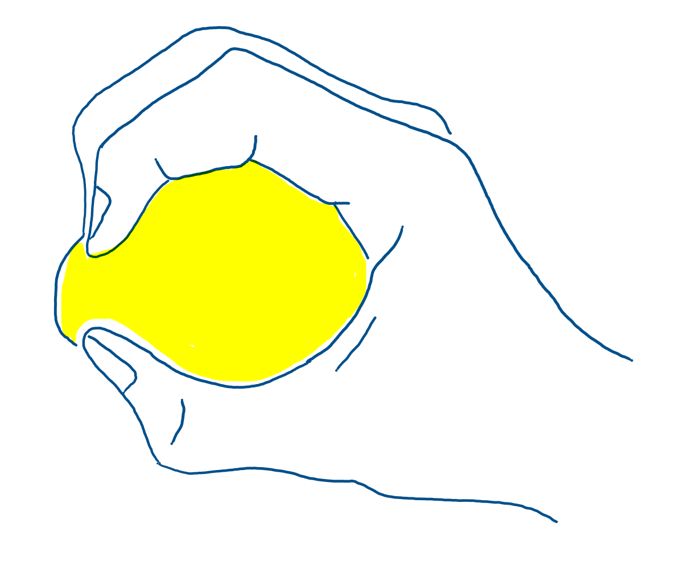
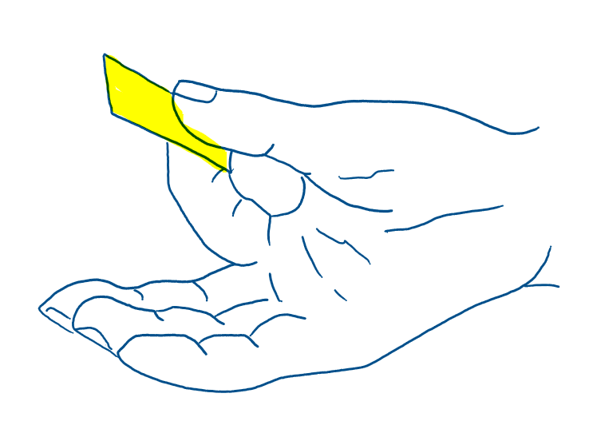
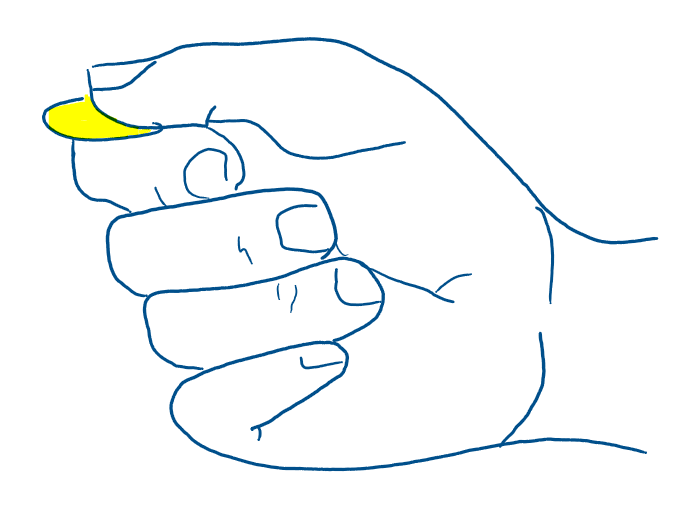

## Development 2

### Doelstellingen
Het hoofddoel van deze fase is het ergonomisch maken van het product. 

### Materiaal & methoden
Om de beer op ergonomisch vlak te kunnen evalueren, werd hij geanalyseerd op zijn verschillende componenten. Al snel werd duidelijk dat enkel de oren (die dienen als knoppen) een ergonomisch aspect bevatten. Deze knoppen moeten namelijk gemakkelijk inknijpbaar zijn en goed in de hand liggen van kinderen.

Er werd een antropometrische analyse uitgevoerd waarbij onderzocht werd op welke verschillende manieren kinderen kunnen knijpen in een voorwerp en welke krachten zij daarbij uitoefenen. De nodige informatie werd gehaald uit een academisch verslag, gevonden via Google Scholar, aangezien bestaande antropometrische databanken niet veel specifieke gegevens bevatten over kinderhanden. In dit verslag werden verschillende tabellen met krachtwaarden geraadpleegd. Hieruit werden enkel de resultaten voor 5 – 6 jarigen gebruikt, aangezien deze de enige zijn die zich in de doelgroep bevinden. Daarnaast werd het principe van “design for the small” toegepast, zodat het ontwerp ook geschikt blijft voor grotere handen en sterkere krachten.

Deze analyse maakte het duidelijk wat er verder onderzocht moest worden in de gebruikerstesten. Tijdens de testen werd gekeken naar de handzetting van de kinderen op de oren en naar welke oorgrootte zij het meest gebruiksvriendelijk vinden.

### Resultaten

#### Antropometrisch onderzoek
Uit de antropometrische analyse is gebleken dat er toch een groot verschil is in de uitgeoefende krachten, afhankelijk van de manier van knijpen. Dit wordt weergegeven in onderstaande tabel, waarin telkens de minimale krachtwaarden zijn opgenomen. 

|Soort kracht|Minimum kracht (in N)|Afbeelding|
|-------------|-------------|-----------|
|Grip strength|75.62||
|Palmar pinch strength|13.79||
|Lateral pinch strength|8.01||

Uit deze tabel blijkt dat het belangrijk is om rekening te houden met de manier waarop kinderen de knoppen bedienen. De kracht die wordt uitgeoefend met de vingers verschilt namelijk sterk van de kracht die met de volledige hand wordt gebruikt. Het is daarom belangrijk om te weten te komen hoe kinderen de knoppen spontaan indrukken. 

Voor het bepalen van de grootte van de knoppen werd er geen bruikbare data gevonden. Daarom worden er verschillende quick-and-dirty prototypes gemaakt met variërende knopgroottes, zodat getest kan worden welke afmetingen het meest comfortabel zijn voor de kinderen.

#### Testinterviews
### Conclusies & implicaties