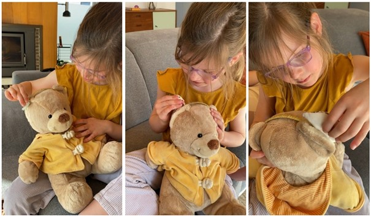
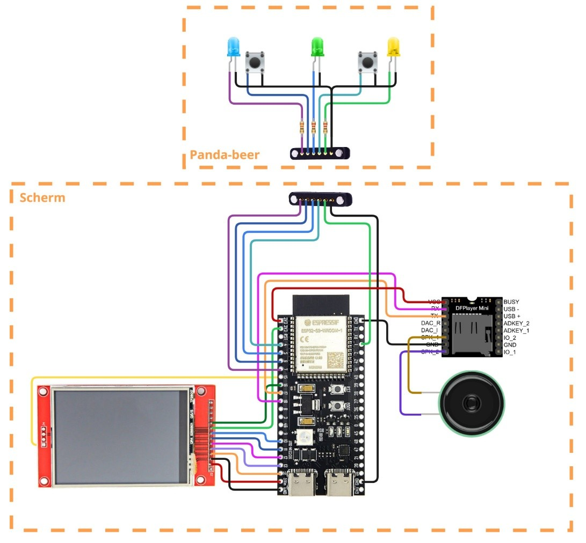
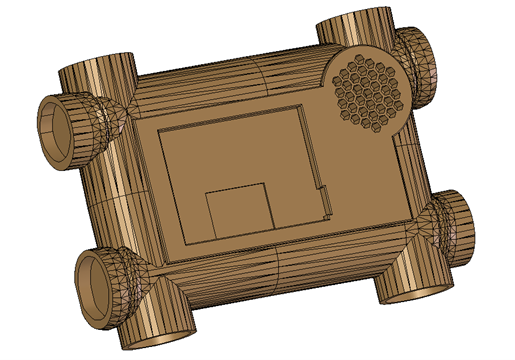
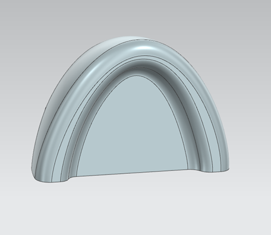
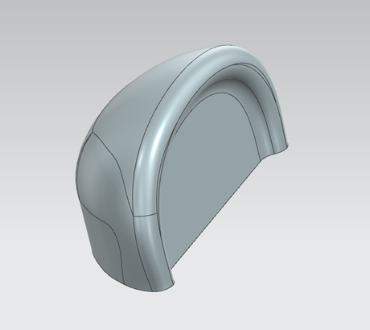
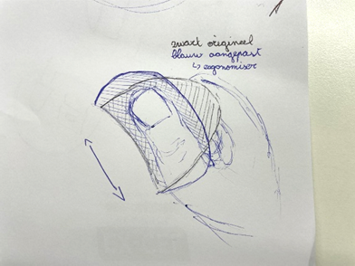

## Development 2

### Doelstellingen
Het hoofddoel van deze fase is het ergonomisch maken van het product en wordt de opstelling verbeterd.

### Ergonomie

#### Materiaal & methoden
Om de beer op ergonomisch vlak te kunnen evalueren, werd hij geanalyseerd op zijn verschillende componenten. Al snel werd duidelijk dat enkel de oren (die dienen als knoppen) een ergonomisch aspect bevatten. Deze knoppen moeten namelijk gemakkelijk inknijpbaar zijn en goed in de hand liggen van kinderen.

Er werd een antropometrische analyse uitgevoerd waarbij onderzocht werd op welke verschillende manieren kinderen kunnen knijpen in een voorwerp en welke krachten zij daarbij uitoefenen. De nodige informatie werd gehaald uit een academisch verslag, gevonden via Google Scholar, aangezien bestaande antropometrische databanken niet veel specifieke gegevens bevatten over kinderhanden. In dit verslag werden verschillende tabellen met krachtwaarden geraadpleegd. Hieruit werden enkel de resultaten voor 5 – 6 jarigen gebruikt, aangezien deze de enige zijn die zich in de doelgroep bevinden. Daarnaast werd het principe van “design for the small” toegepast, zodat het ontwerp ook geschikt blijft voor grotere handen en sterkere krachten.

Deze analyse maakte het duidelijk wat er verder onderzocht moest worden in de gebruikerstesten. Tijdens de testen werd gekeken naar de handzetting van de kinderen op de oren en naar welke oorgrootte zij het meest gebruiksvriendelijk vinden.

#### Resultaten

##### Antropometrisch onderzoek
Uit de antropometrische analyse is gebleken dat er toch een groot verschil is in de uitgeoefende krachten, afhankelijk van de manier van knijpen. Dit wordt weergegeven in onderstaande tabel, waarin telkens de minimale krachtwaarden zijn opgenomen. 

|Soort kracht|Minimum kracht (in N)|Afbeelding|
|-------------|-------------|-----------|
|Grip strength|75.62||
|Palmar pinch strength|13.79||
|Lateral pinch strength|8.01||

Uit deze tabel blijkt dat het belangrijk is om rekening te houden met de manier waarop kinderen de knoppen bedienen. De kracht die wordt uitgeoefend met de vingers verschilt namelijk sterk van de kracht die met de volledige hand wordt gebruikt. Het is daarom belangrijk om te weten te komen hoe kinderen de knoppen spontaan indrukken. 

Voor het bepalen van de grootte van de knoppen werd er geen bruikbare data gevonden. Daarom worden er verschillende quick-and-dirty prototypes gemaakt met variërende knopgroottes, zodat getest kan worden welke afmetingen het meest comfortabel zijn voor de kinderen.

##### Testinterviews
Er wordt gevraagd aan het kind om in de oor van de beer te knijpen zoals te zien is in onderstaande afbeelding en dit wordt dan herhaald voor de verschillende groottes.

De positie van de hand werd per oorgrootte vijf keer geobserveerd. Deze observaties worden samengevat in onderstaande tabel.

|            | 1                | 2                     | 3                | 4                | 5                |
|------------|------------------|-----------------------|------------------|------------------|------------------|
| **Kleinste**   | Duim + 2 vingers | Duim + 2 vingers      | Duim + 2 vingers | Duim + 2 vingers | Duim + 2 vingers |
| **Middelste**  | Duim + 1 vinger  | Duim + 3 vingers      | Duim + 2 vingers | Duim + 3 vingers | Volledig hand    |
| **Grootste**   | Duim + 3 vingers | Duim + zijkant vinger | Duim + 3 vingers | Duim + 3 vingers | Duim + 3 vingers |

Uit de resultaten kan worden afgeleid dat de knop meestal wordt bediend met de duim in combinatie met één of meerdere vingers. Deze manier van vasthouden lijkt de voorkeur te hebben. Daarnaast is er een duidelijk verschil zichtbaar afhankelijk van de grootte van het oor. Bij het kleinste oor wordt hele tijd gebruikgemaakt van de duim samen met twee vingers. Bij het middelste oor varieert de handpositie sterker, van de duim met één vinger tot het gebruik van het volledige hand. Bij het grootste oor wordt voornamelijk de duim samen met drie vingers gebruikt.

Hieruit kan worden afgeleid dat de grootte van het oor invloed heeft op hoe het kindje de knop vastneemt en gebruikt. Grotere oren zorgen ervoor dat er meer vingers worden gebruikt, terwijl kleinere oren leiden tot een beperktere maar meer vaste handpositie.

Tijdens de evaluatie achteraf gaf het kindje aan dat het middelste oor het meest comfortabel en het gemakkelijkst in gebruik was. Dit komt overeen met de grotere variatie in handposities, wat erop kan wijzen dat deze grootte meer flexibiliteit biedt. 

### Opstelling
In develop 1 werd de testopstelling uitgelegd. In deze opstelling werd een Arduino mega en 3.5 inch TFT display shield gebruikt. Echter werd vastgesteld dat er geen GIF’s afgespeeld kunnen worden via deze methode. Afbeeldingen kunnen wel afgespeeld worden, maar zeer traag. We hebben ervoor gekozen om toch over te schakelen naar een andere opstelling.

In deze opstelling wordt een ESP32-S3 en 2.8 inch TFT display gebruikt. Dit scherm gebruikt de ILI9341 SPI driver i.p.v. ili9486 library. Daarnaast is de ESP32 meer geschikt om GIF’s te laten afspelen. Er werden verschillende GIF’s gemaakt rond dezelfde taak, maar elk in een verschillende stijl. Er zal later gekeken worden welke stijl de kinderen liever hebben:

    

Naast de GIF’s werd ook al een eerste model gemaakt van hoe het omhulsel van het scherm er zal uit zien:

Het model werd al eens geprint om te kijken of alle componenten erin passen. 

### Conclusies & implicaties

#### Ergonomie
De middelste oorgrootte is het meest geschikt, omdat deze het comfortabelst en het gemakkelijkst in gebruik is. 

De beste handzetting is het gebruik van de duim in combinatie met twee tot drie vingers, omdat deze het vaakst voorkomt en voldoende controle en stabiliteit biedt.

> [!IMPORTANT]
> **Design Requirements**
>- 2.8 Het  oor heeft een grootte die comfortabel en gemakkelijk te gebruiken is voor een kind.
>- 2.9 Het oor ondersteunt een handpositie waarbij de duim samenwerkt met twee tot drie vingers.
>- 2.10 Het oor heeft een voldoende grote contactoppervlak voor een stabiele grip.

##### Aanpassingen oortjes
Tijdens het iteratief ontwerpproces werd de vorm van de oortjes verder verfijnd op basis van de design requirements. Het oorspronkelijke ontwerp bestond uit een langwerpig oortje, maar dit bleek minder geschikt. Enerzijds was deze vorm te lang voor de voorziene mal, en anderzijds zorgde dit voor een minder optimale interactie.

 

Een compacter en breder oortje bood een duidelijk betere ergonomische ervaring. Doordat de breedte meer in verhouding staat tot de grootte van de beer, ontstaat er een groter contactoppervlak. Dit verhoogt de kans dat kinderen effectief druk uitoefenen op de juiste plaats en dus succesvol de knop activeren. Bij het langwerpige ontwerp bestond namelijk het risico dat kinderen op de zijkant drukten zonder de interne knop in te drukken. Dit probleem wordt met de huidige vorm vermeden.

 

#### Opstelling
De volgende stappen in het project zijn:
1.	Testen van oren + scherm
2.	Een manier bedenken om het scherm draagbaar te maken door bv. batterijen te gebruiken.