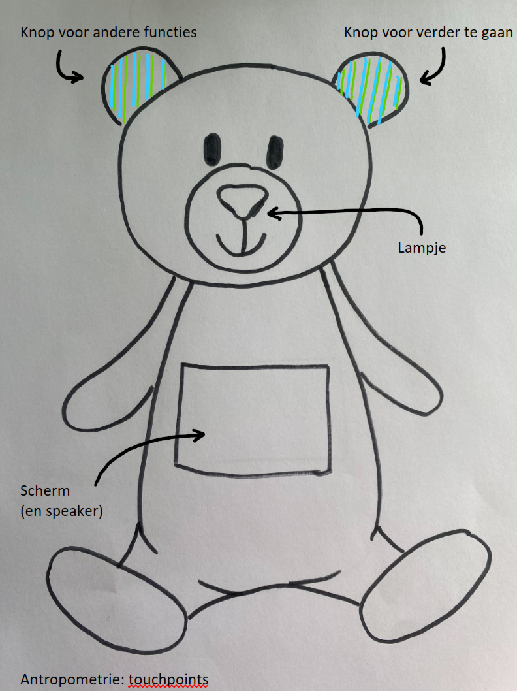
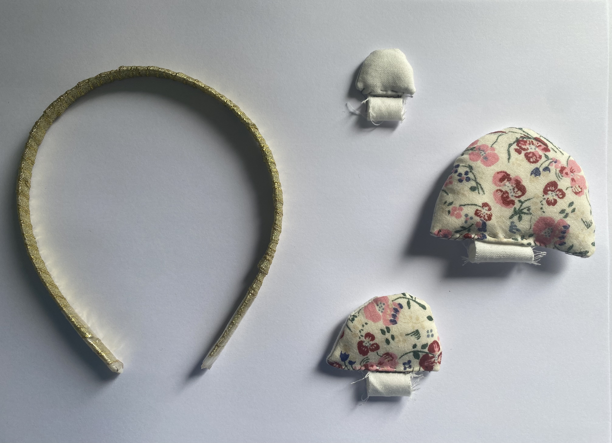
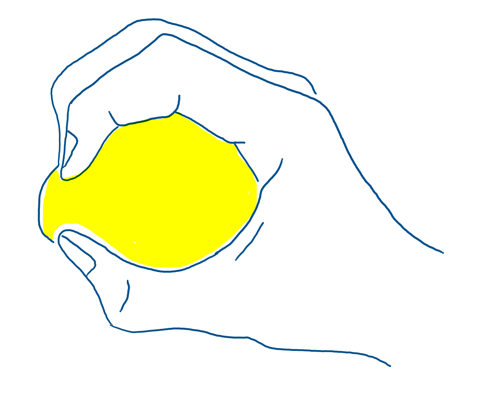
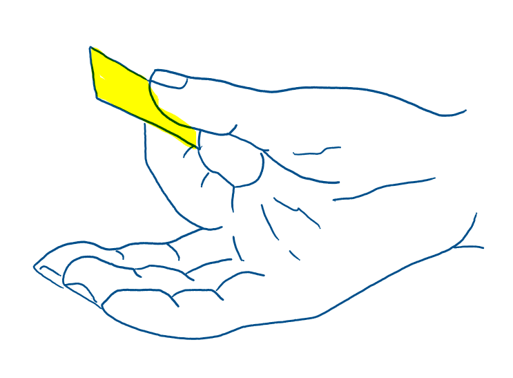
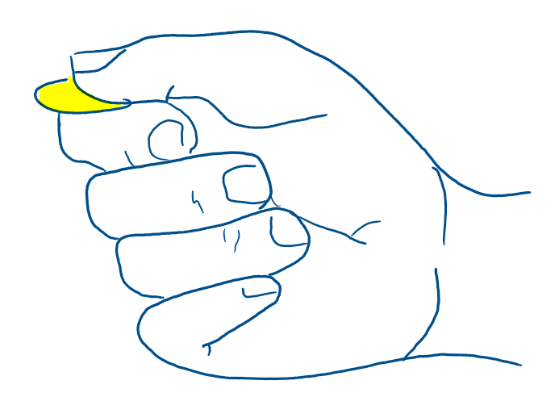
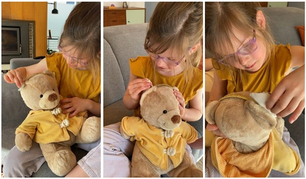
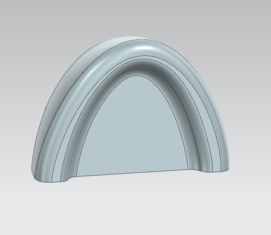
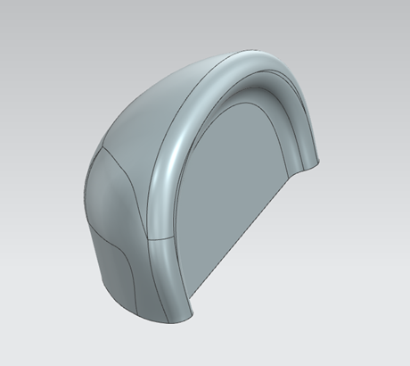
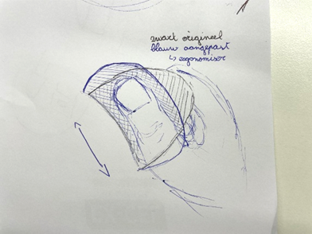

## Development 2

### Doelstellingen
Het hoofddoel van deze fase is het ergonomisch maken van het product en wordt de opstelling verbeterd.

---

### Ergonomie

#### Materiaal & methoden
Om de beer op ergonomisch vlak te kunnen evalueren, werd hij geanalyseerd op zijn verschillende componenten. Al snel werd duidelijk dat enkel de oren (die dienen als knoppen) een ergonomisch aspect bevatten. Deze knoppen moeten namelijk gemakkelijk inknijpbaar zijn en goed in de hand liggen van kinderen.

Er werd een antropometrische analyse uitgevoerd waarbij onderzocht werd op welke verschillende manieren kinderen kunnen knijpen in een voorwerp en welke krachten zij daarbij uitoefenen. De nodige informatie werd gehaald uit een academisch verslag, gevonden via Google Scholar, aangezien bestaande antropometrische databanken niet veel specifieke gegevens bevatten over kinderhanden. In dit verslag werden verschillende tabellen met krachtwaarden geraadpleegd. Hieruit werden enkel de resultaten voor 5 – 6 jarigen gebruikt, aangezien deze de enige zijn die zich in de doelgroep bevinden. Daarnaast werd het principe van “design for the small” toegepast, zodat het ontwerp ook geschikt blijft voor grotere handen en sterkere krachten.

Deze analyse maakte het duidelijk wat er verder onderzocht moest worden in de gebruikerstesten. Tijdens de testen werd gekeken naar de handzetting van de kinderen op de oren en naar welke oorgrootte zij het meest gebruiksvriendelijk vinden. Het prototype hiervoor is te zien in onderstaande afbeelding.

Het protocol van de gebruikerstesten is [hier](https://drive.google.com/file/d/18UV0sOgIwRFaU0k2yumadGYeaR9zQ-xK/view?usp=sharing) te vinden.

#### Resultaten

##### Antropometrisch onderzoek
Uit de antropometrische analyse is gebleken dat er toch een groot verschil is in de uitgeoefende krachten, afhankelijk van de manier van knijpen. Dit wordt weergegeven in onderstaande tabel, waarin telkens de minimale krachtwaarden zijn opgenomen. 

|Soort kracht|Minimum kracht (in N)|Afbeelding|
|-------------|-------------|-----------|
|Grip strength|75.62||
|Palmar pinch strength|13.79||
|Lateral pinch strength|8.01||

Uit deze tabel blijkt dat het belangrijk is om rekening te houden met de manier waarop kinderen de knoppen bedienen. De kracht die wordt uitgeoefend met de vingers verschilt namelijk sterk van de kracht die met de volledige hand wordt gebruikt. Het is daarom belangrijk om te weten te komen hoe kinderen de knoppen spontaan indrukken. 

Voor het bepalen van de grootte van de knoppen werd er geen bruikbare data gevonden. Daarom worden er verschillende quick-and-dirty prototypes gemaakt met variërende knopgroottes, zodat getest kan worden welke afmetingen het meest comfortabel zijn voor de kinderen.

De analyse van het antropometrisch onderzoek is [hier](https://drive.google.com/file/d/1W2tFgDZaNar4k2NG-botPuARzz3v3zZD/view?usp=sharing) te vinden.

##### Testinterviews
Er wordt gevraagd aan het kind om in de oor van de beer te knijpen zoals te zien is in onderstaande afbeelding en dit wordt dan herhaald voor de verschillende groottes.

De positie van de hand werd per oorgrootte vijf keer geobserveerd. Deze observaties worden samengevat in onderstaande tabel.

|            | 1                | 2                     | 3                | 4                | 5                |
|------------|------------------|-----------------------|------------------|------------------|------------------|
| **Kleinste**   | Duim + 2 vingers | Duim + 2 vingers      | Duim + 2 vingers | Duim + 2 vingers | Duim + 2 vingers |
| **Middelste**  | Duim + 1 vinger  | Duim + 3 vingers      | Duim + 2 vingers | Duim + 3 vingers | Volledig hand    |
| **Grootste**   | Duim + 3 vingers | Duim + zijkant vinger | Duim + 3 vingers | Duim + 3 vingers | Duim + 3 vingers |

Uit de resultaten kan worden afgeleid dat de knop meestal wordt bediend met de duim in combinatie met één of meerdere vingers. Deze manier van vasthouden lijkt de voorkeur te hebben. Daarnaast is er een duidelijk verschil zichtbaar afhankelijk van de grootte van het oor. Bij het kleinste oor wordt hele tijd gebruikgemaakt van de duim samen met twee vingers. Bij het middelste oor varieert de handpositie sterker, van de duim met één vinger tot het gebruik van het volledige hand. Bij het grootste oor wordt voornamelijk de duim samen met drie vingers gebruikt.

Hieruit kan worden afgeleid dat de grootte van het oor invloed heeft op hoe het kindje de knop vastneemt en gebruikt. Grotere oren zorgen ervoor dat er meer vingers worden gebruikt, terwijl kleinere oren leiden tot een beperktere maar meer vaste handpositie.

Tijdens de evaluatie achteraf gaf het kindje aan dat het middelste oor het meest comfortabel en het gemakkelijkst in gebruik was. Dit komt overeen met de grotere variatie in handposities, wat erop kan wijzen dat deze grootte meer flexibiliteit biedt. 

Het report van de gebruikerstesten is [hier](https://drive.google.com/file/d/10HXQ8sNEB7mYRsCe3yflU_DUqUeTnOM8/view?usp=sharing) te vinden.

---

### Feedback
#### Visueel
Het is belangrijk dat het kind duidelijk begrijpt welke taak uitgevoerd moet worden en op welke manier deze uitgevoerd kan worden. Om de taakjes visueel weer te geven, worden GIF-animaties gebruikt die afgespeeld worden op het TFT-display.

Binnen het systeem wordt een onderscheid gemaakt tussen taakjes en hints. De taakjes tonen enkel de actie die uitgevoerd moet worden. Op deze manier krijgt het kind informatie over wat er moet gebeuren, zonder extra uitleg over de uitvoering. De hints leggen daarentegen meer nadruk op hoe de taak uitgevoerd moet worden en tonen daarom een meer gedetailleerde weergave van de actie.

    

Omdat de GIF-bestanden momenteel opgeslagen worden in het interne geheugen van de ESP32, is de beschikbare opslagruimte beperkt. Hierdoor moeten de animaties relatief eenvoudig blijven en kunnen ze minder gedetailleerde beelden bevatten. Vooral de GIF-animaties die de uitvoering van een taak uitleggen, zullen hierdoor beperkt zijn in lengte en detail.

Wanneer in een toekomstige versie gebruikgemaakt wordt van de SD-kaartlezer die geïntegreerd is in het TFT-display, kan de opslagcapaciteit aanzienlijk uitgebreid worden. Hierdoor wordt het mogelijk om langere en meer gedetailleerde GIF-animaties te gebruiken.

#### Audio
Naast visuele feedback wordt ook audiofeedback voorzien. Elk taakje wordt eerst door een stem uitgesproken, zodat het kind de opdracht correct begrijpt en de GIF-animatie niet verkeerd interpreteert. Voor de hints wordt eveneens een gesproken uitleg voorzien die beschrijft hoe de taak uitgevoerd moet worden, gevolgd door een ondersteunend muziekje.

Wanneer een taak succesvol voltooid is, krijgt het kind positieve bevestiging via een applausgeluid. Op deze manier wordt de interactie niet enkel informatief, maar ook motiverend gemaakt.

---

### Conclusies & implicaties

#### Ergonomie
Uit het ergonomisch onderzoek en de gebruikerstesten blijkt dat de grootte en vorm van het oor een belangrijke invloed hebben op het gebruiksgemak van de beer. De resultaten geven inzicht in hoe kinderen de oren vastnemen en bedienen, en welke eigenschappen bijdragen aan een comfortabele en betrouwbare interactie.

In onderstaande tabel worden de conclusies weergegeven met de bijhorende reden of onderbouwing waarop de design requirements gebaseerd zijn. 

| Conclusie | Reden |
|-----------|-------|
| Het oor moet een grootte hebben die comfortabel en gemakkelijk te gebruiken is voor kinderen. | Tijdens de gebruikerstesten gaf het kind aan dat het middelste oor het meest comfortabel en het gemakkelijkst in gebruik was. De variatie in handposities wijst erop dat deze grootte voldoende flexibiliteit biedt voor verschillende manieren van vasthouden. |
| Het oor moet een voldoende groot contactoppervlak hebben voor een stabiele grip. | Observaties tonen aan dat kinderen de knop voornamelijk bedienen met de duim en één of meerdere vingers. Een compacter en breder oor biedt een groter contactoppervlak, waardoor kinderen gemakkelijker druk uitoefenen op de juiste plaats en de knop betrouwbaarder activeren. |

> [!IMPORTANT]
> **Design Requirements**
>- 2.8 Het  oor heeft een grootte die comfortabel en gemakkelijk te gebruiken is voor een kind.
>- 2.9 Het oor heeft een voldoende grote contactoppervlak voor een stabiele grip.

#### Aanpassingen oortjes
Tijdens het iteratief ontwerpproces werd de vorm van de oortjes verder verfijnd op basis van de design requirements. Het oorspronkelijke ontwerp bestond uit een langwerpig oortje, maar dit bleek minder geschikt. Enerzijds was deze vorm te lang voor de voorziene mal, en anderzijds zorgde dit voor een minder optimale interactie.

 

Een compacter en breder oortje bood een duidelijk betere ergonomische ervaring. Doordat de breedte meer in verhouding staat tot de grootte van de beer, ontstaat er een groter contactoppervlak. Dit verhoogt de kans dat kinderen effectief druk uitoefenen op de juiste plaats en dus succesvol de knop activeren. Bij het langwerpige ontwerp bestond namelijk het risico dat kinderen op de zijkant drukten zonder de interne knop in te drukken. Dit probleem wordt met de huidige vorm vermeden.

 

#### Opstelling
De volgende stappen in het project zijn:
1.	Testen van oren + scherm
2.	Een manier bedenken om het scherm draagbaar te maken door bv. batterijen te gebruiken.