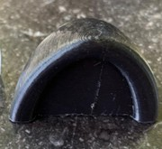
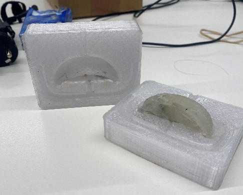
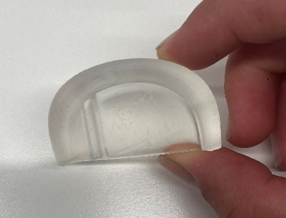
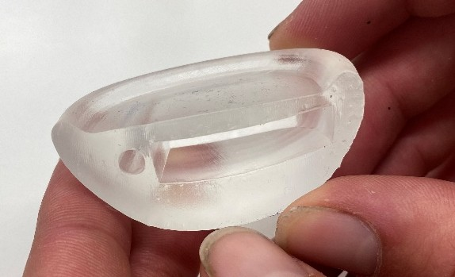
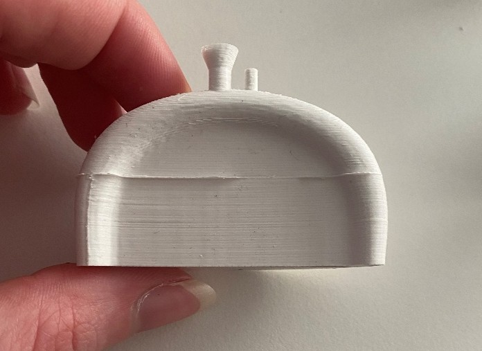
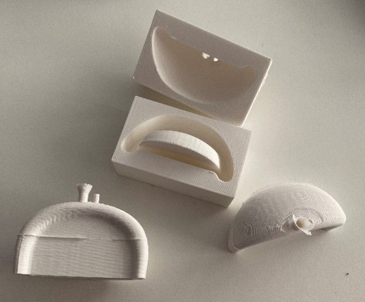

## Development 3

### Doelstellingen
Het hoofddoel van deze fase is het analyseren van de CMF van de verschillende componenten.

### Materiaal & methoden

Vooraleer een CMF-analyse kon worden uitgevoerd, werden de verschillende componenten van het product eerst geëvalueerd en werd bepaald op welke onderdelen de analyse van toepassing zou zijn.

Er werd besloten om de oortjes te analyseren op basis van kleur en materiaal. Het omhulsel wordt vervolgens beoordeeld op kleur en textuur.

#### Materiaalkeuze van de oortjes
Voor de materiaalkeuze werden verschillende varianten ontwikkeld en geëvalueerd. Op basis van hun eigenschappen werden deze opties vergeleken om te bepalen welke het meest geschikt is.

#### Interviews
Voor volgende zaken werden interviews gedaan:
- Kleurkeuze van de oortjes
- Kleurkeuze van het omhulsel
- Textuurkeuze van het omhulsel

Voor de kleurkeuzes werden verschillende renders ontwikkeld voor de uiteenlopende ontwerpopties, die vervolgens werden samengebracht in een PowerPointpresentatie. Tijdens een interview werden deze varianten voorgelegd aan gebruikers, waarbij werd onderzocht welke ontwerpen als meest aantrekkelijk werden ervaren.

Voor de keuze van de textuur werden verschillende varianten aan gebruikers gepresenteerd. Zij konden de materialen ook zelf voelen, zodat op basis van hun ervaring de meest geschikte optie kon worden geselecteerd.

### Resultaten

#### Kleurkeuze van de oortjes

#### Materiaalkeuze van de oortjes
Binnen het concept van de interactieve beer functioneren de oortjes niet alleen als visueel element, maar ook als fysieke interface. Omdat de oortjes zowel indrukbaar moesten zijn als lichtfeedback moesten kunnen tonen, vormden ze een belangrijk onderdeel van het CMF-onderzoek (Color, Material, Finish). De vorm van het oor was reeds bepaald tijdens Develop 2, waar ergonomisch onderzocht werd welke vorm het best indrukbaar was en tegelijkertijd voldoende drukkracht kon overbrengen naar de interne knop. In Develop 3 verschoof de focus daarom naar materiaalkeuze, tactiliteit en afwerking.

Als eerste stap werd een volledig 3D-geprint prototype gemaakt. Dit hielp om de schaal, vorm en fysieke interactie beter te evalueren. Hoewel de vorm ergonomisch goed werkte, voelde het harde materiaal onvoldoende zacht aan voor een knuffelproduct. Hierdoor werd duidelijk dat het uiteindelijke materiaal niet alleen functioneel, maar ook emotioneel en tactiel moest aansluiten bij de rest van de beer. 

Vervolgens werd een mal ontworpen om een zachter gietmateriaal te testen. Dit materiaal had een aangename textuur en voelde duidelijk zachter en kindvriendelijker aan. Tijdens het productieproces bleek echter dat het materiaal moeilijk uit de mal verwijderd kon worden zonder te scheuren of vervormen. Daarnaast sloot de kleur en afwerking minder goed aan bij de visuele uitstraling van de beer, waardoor het materiaal minder geschikt bleek binnen het bredere CMF-verhaal van het product.

Daarna werd een SLA-geprint oortje getest. Dit prototype had een zeer nauwkeurige vormgeving en was volledig transparant, waardoor het interne LED-licht zeer zichtbaar werd. Op vlak van visuele feedback werkte dit dus uitstekend. Het materiaal was echter te hard en nauwelijks indrukbaar, waardoor de knopfunctie verloren ging. Hoewel deze variant sterk scoorde op lichttransmissie en esthetiek, faalde ze op ergonomie en tactiele interactie.

 

Op basis van deze iteraties werd uiteindelijk gekozen voor silicone als finaal materiaal. Hiervoor werd een aparte gietmal ontworpen waarin silicone gegoten en uitgehard werd. Silicone combineerde verschillende belangrijke eigenschappen:
- het materiaal neemt nauwkeurig de gewenste vorm aan
- het is elastisch en goed indrukbaar
- het voelt zacht en comfortabel aan
- het biedt voldoende grip tijdens het knijpen

Deze tactiele eigenschappen sluiten sterk aan bij de gewenste user experience van de beer als zacht en veilig knuffelobject. Silicone ondersteunt bovendien de affordance van het oor: kinderen begrijpen intuïtief dat het oor indrukbaar is.

 

Een aandachtspunt binnen deze materiaalkeuze was de beperkte lichtdoorlaatbaarheid van silicone. Hierdoor werd de zichtbaarheid van de LED-feedback verminderd. Om dit op te lossen werd een kleine opening voorzien in het oortje, waardoor het LED-licht toch duidelijk zichtbaar blijft tijdens interactie. Op deze manier bleef zowel de visuele feedback als de zachte tactiele ervaring behouden.

Dit CMF-onderzoek toont aan dat de uiteindelijke materiaalkeuze niet louter esthetisch bepaald werd, maar het resultaat is van een iteratief proces waarin ergonomie, tactiliteit, emotionele ervaring, lichtfeedback en produceerbaarheid voortdurend tegen elkaar werden afgewogen.

#### Kleurkeuze van het omhulsel

#### Textuurkeuze van het omhulsel

### Conclusies & implicaties

### Opstelling 