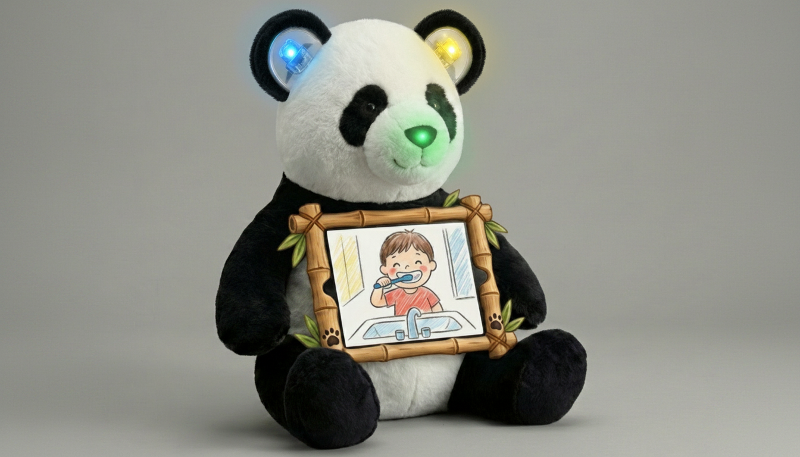
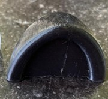
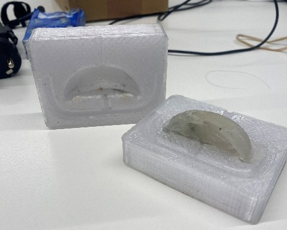
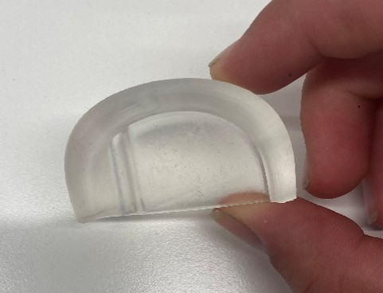
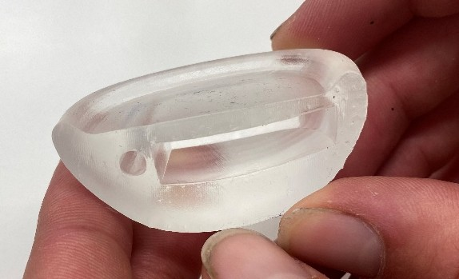
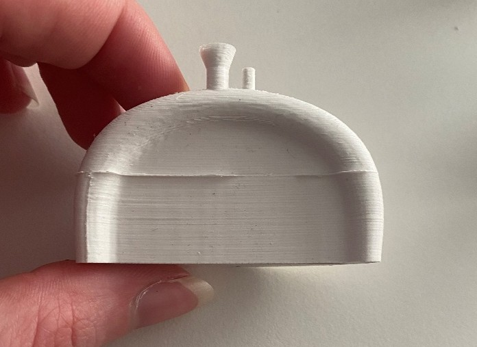
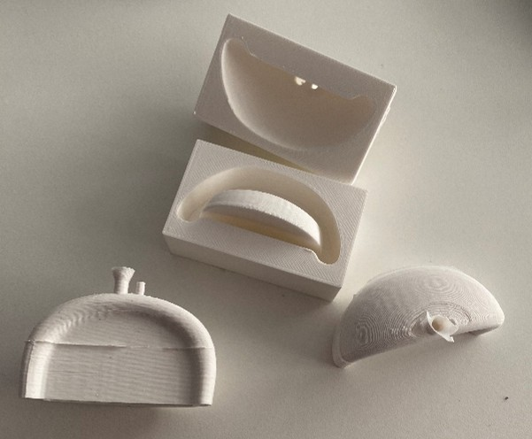
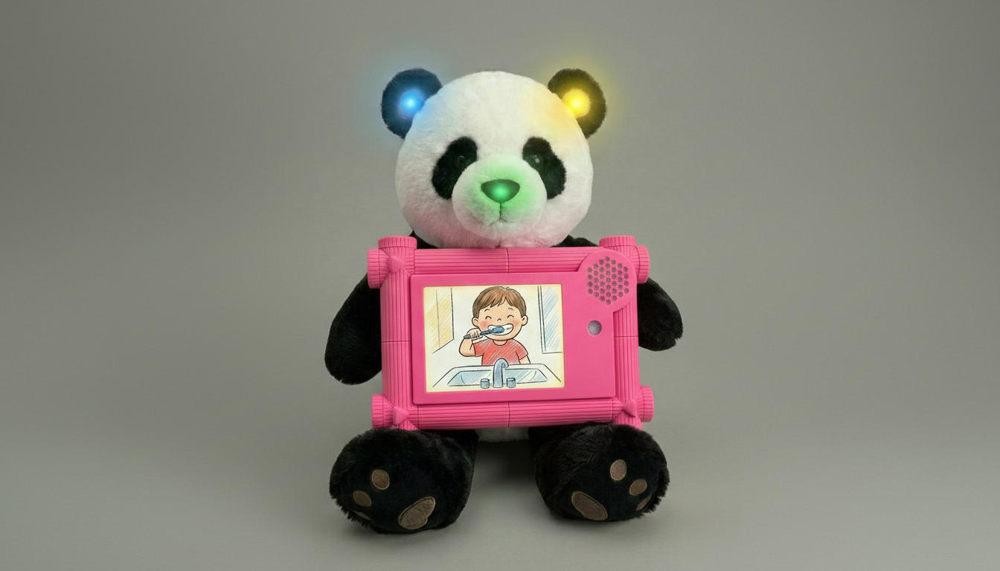
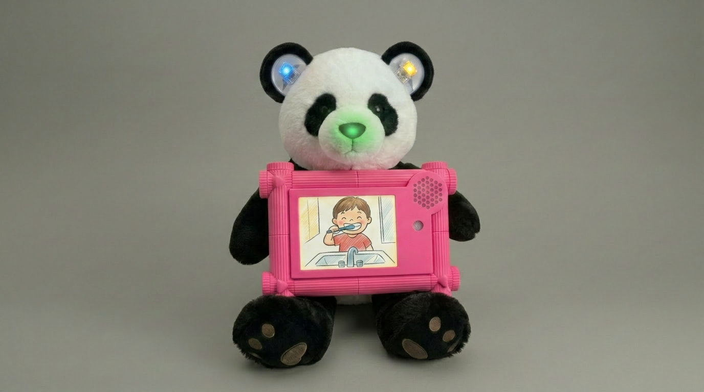

## Development 3

### Doelstellingen
Het hoofddoel van deze fase is het analyseren van de CMF van de verschillende componenten.

---

### Materiaal & methoden

Vooraleer een CMF-analyse kon worden uitgevoerd, werden de verschillende componenten van het product eerst geëvalueerd en werd bepaald op welke onderdelen de analyse van toepassing zou zijn.

Er werd besloten om de oortjes te analyseren op basis van kleur en materiaal. Het omhulsel wordt vervolgens beoordeeld op kleur en textuur.

#### Materiaalkeuze van de oortjes
Voor de materiaalkeuze werden verschillende varianten ontwikkeld en geëvalueerd. Op basis van hun eigenschappen werden deze opties vergeleken om te bepalen welke het meest geschikt is.

#### Interviews
Voor volgende zaken werden interviews gedaan:
- Kleurkeuze van de oortjes
- Kleurkeuze van het omhulsel
- Textuurkeuze van het omhulsel

Voor de kleurkeuzes werden verschillende renders ontwikkeld voor de uiteenlopende ontwerpopties, die vervolgens werden samengebracht in een PowerPointpresentatie. Tijdens een interview werden deze varianten voorgelegd aan gebruikers, waarbij werd onderzocht welke ontwerpen als meest aantrekkelijk werden ervaren.

De PowerPointpresentaties zijn hier te vinden: [omhulsel](https://drive.google.com/file/d/1jtBIYcoHiLNUWgVYdP9SYzcHUyG76-D9/view?usp=sharing) en [oortjes](https://drive.google.com/file/d/1XNqXtDPErmhQJFLdnw9bNmKRSQDc-u7y/view?usp=sharing).

Voor de keuze van de textuur werden verschillende varianten aan gebruikers gepresenteerd. Zij konden de materialen ook zelf voelen, zodat op basis van hun ervaring de meest geschikte optie kon worden geselecteerd.

Het protocol van deze interviews is hier te vinden: [interview protocol](https://drive.google.com/file/d/1nMEvOunnXXP05v1LXsKzn6qRlS9hDP_Y/view?usp=sharing)

Het report van deze interviews is hier te vinden: [interview report](https://drive.google.com/file/d/1Gyd1z_1kM8eNMYuMG_D5NSGw8vEMbcCc/view?usp=sharing)

---

### Resultaten

#### Kleurkeuze van de oortjes
Bij de keuze van de oren was er meteen een duidelijke favoriet. Zowel de kinderen als de ouders kozen unaniem voor de optie met een zwart randje. Deze versie werd als het mooist en meest afgewerkt ervaren. Volgens hen zorgde het zwarte randje ervoor dat de oren beter zichtbaar zijn en dat de panda meer karakter krijgt.

Daarnaast sloot deze optie beter aan bij de rest van het ontwerp, waardoor de panda een meer herkenbare en samenhangende uitstraling kreeg. Het geheel oogde daardoor rustiger en aantrekkelijker dan de andere opties.

#### Materiaalkeuze van de oortjes
Binnen het concept van de interactieve beer zijn de oortjes niet alleen een visueel element, maar ook een fysieke interface. Omdat ze indrukbaar moesten zijn en LED-feedback moesten ondersteunen, vormden ze een belangrijk onderdeel van het CMF-onderzoek. De vorm werd al bepaald in Develop 2 op basis van ergonomie; in Develop 3 lag de focus op materiaal, tactiliteit en afwerking.

Eerst werd een 3D-geprint prototype getest. Dit gaf een goed beeld van schaal en interactie, maar het harde materiaal voelde te weinig zacht voor een knuffelproduct.

Daarna werd een zachter gietmateriaal getest via een mal. Dit voelde aangenamer aan, maar bleek moeilijk uit de mal te halen en sloot visueel minder goed aan bij het ontwerp qua kleur en afwerking.

Vervolgens werd een SLA-prototype onderzocht. Dit gaf sterke LED-visibility door het transparante materiaal, maar was te hard en niet indrukbaar, waardoor de knopfunctie verloren ging.

 

Uiteindelijk werd gekozen voor silicone als eindmateriaal. Hiervoor werd een aparte gietmal ontworpen waarin silicone gegoten en uitgehard werd. 

Silicone combineert volgende belangrijke eigenschappen:
- zachtheid
- elasticiteit
- goede indrukbaarheid 
- voldoende grip

Daardoor sluit het beter aan bij de gewenste gebruikerservaring. Silicone is bovendien zeer intuïtief omdat kinderen vanzelf aanvoelen dat het indrukbaar is.

 

Een nadeel is de beperkte lichtdoorlaatbaarheid, waardoor de LED minder zichtbaar wordt. Dit werd opgelost door een kleine opening in het oortje te voorzien, zodat de feedback toch duidelijk blijft.

#### Kleurkeuze van het omhulsel
Wat betreft het kleurgebruik van het omhulsel gaven de kinderen duidelijk aan dat ze een voorkeur hebben voor felle en opvallende kleuren. Van de voorgestelde opties werd vooral felroze het vaakst gekozen. Dit verschilt van de voorkeur van de ouders. Zij kiezen liever voor kleuren die beter passen bij hun interieur en minder opvallen in de leefomgeving. Hun voorkeur gaat vooral uit naar neutrale, natuurlijke kleuren en zachte pastelkleuren.

Uit de gesprekken bleek wel dat ouders bereid zijn om hierin een compromis te maken. Omdat het product in de eerste plaats bedoeld is voor kinderen, vinden zij het belangrijk dat het aantrekkelijk is voor hun kind en effectief gebruikt wordt. Als felle kleuren ervoor zorgen dat de panda vaker gebruikt wordt of meer interesse opwekt bij het kind, staan ouders ervoor open om af te wijken van hun eigen voorkeuren.

Hoewel felroze het populairst was als kleur voor het omhulsel, moet er rekening mee gehouden worden dat enkel meisjes deelnamen aan de bevraging. Daardoor kunnen de resultaten beïnvloed zijn door persoonlijke of stereotype kleurvoorkeuren en zijn ze mogelijk niet representatief voor alle kinderen.

#### Textuurkeuze van het omhulsel
Bij de keuze van de textuur waren de meningen meer verdeeld. De antwoorden verschilden tussen de opties hout, glad en fijn ruw. Vooral de ouders gaven aan dat ze de houttextuur mooi vonden, omdat deze een warme en natuurlijke uitstraling heeft.

Er werd wel rekening gehouden met het feit dat het uiteindelijke product geen houtkleur zal hebben. Daardoor zou een houttextuur minder realistisch of passend kunnen lijken in het definitieve ontwerp. Daarom werd opnieuw gekeken naar de voorkeuren van de kinderen, aangezien zij de belangrijkste gebruikers van het product zijn.

Uit hun antwoorden bleek dat een gladdere textuur het meest in de smaak viel. Een glad oppervlak werd als aangenamer en zachter ervaren. Daarnaast zorgt een gladde afwerking voor een eenvoudiger ontwerp, waardoor het geheel minder druk oogt.

---

### Conclusies & implicaties
Op basis van de resultaten kan geconcludeerd worden dat er een duidelijk verschil is tussen de voorkeuren van ouders en kinderen. Ouders kiezen voor een rustige, natuurlijke en interieurgerichte uitstraling, terwijl kinderen eerder voorkeur geven aan felle kleuren, zachte materialen en speelsheid. In de uiteindelijke ontwerpbeslissingen zal er eerder worden gekeken naar de voorkeuren van het kind, aangezien het de bedoeling is dat de beer het kind gaat stimuleren / helpen.

Tijdens deze fase zijn op basis van de conclusies uit het onderzoek verschillende design requirements opgesteld. In onderstaande tabel worden deze conclusies weergegeven, samen met de bijhorende onderbouwing.

| Conclusie | Reden |
|-----------|-------|
| Kinderen worden sterker aangetrokken door opvallende en herkenbare visuele elementen. | Kinderen gaven duidelijk de voorkeur aan felle kleuren. Daarnaast kozen zowel kinderen als ouders unaniem voor de oortjes met een zwart randje omdat deze beter zichtbaar waren en de panda meer karakter gaven. |
| Een zachte en indrukbare interactie wordt als het meest natuurlijk ervaren voor de bediening van de oortjes. | Uit de materiaalvergelijking bleek dat silicone de beste combinatie biedt van zachtheid, elasticiteit, indrukbaarheid en grip. Kinderen voelen bovendien intuïtief aan dat het materiaal kan worden ingedrukt. |
|Het product zorgt voor duidelijke visuele lichtfeedback tijdens de interactie.|Kinderen moeten het LED-licht duidelijk kunnen zien tijdens interactie.|
| Kinderen ervaren een glad oppervlak als aangenamer dan een oppervlak met structuur. | Tijdens de interviews werd de gladde textuur het vaakst gekozen omdat deze zachter aanvoelt en het ontwerp eenvoudiger en rustiger maakt. |
| Het product is beschikbaar in verschillende kleurvarianten. | De kleurvoorkeuren werden enkel door meisjes beoordeeld. |

> [!Important]
> Design requirements
> - 3.1 Het product heeft een speels karakter door het gebruik van opvallende kleuren en herkenbare visuele kenmerken.
> - 3.5 De oortjes hebben een zachte en elastische interface.
> - 1.4 Het product geeft visuele feedback aan de gebruiker.
> - 3.6 Het omhulsel voelt glad aan.
> - 3.7 Het product is beschikbaar in verschillende kleurvarianten.