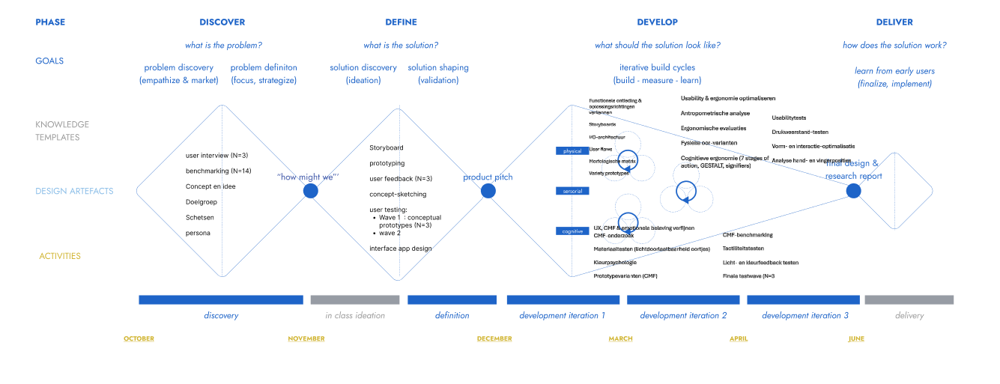

## Methodologie

Het ontwikkelingsproces van Planda Beer volgde een iteratieve, gebruiksgerichte aanpak, gebaseerd op een aangepast Triple Diamond‑model. In SEM1 lag de nadruk op de discover‑ en definitiefase, waarin we de context van opvoedstress, kinderroutines en motivatie onderzochten. Deze inzichten vormden de basis voor de eerste conceptuele richting van Planda Beer.

### Discovery‑fase (SEM1)
In de discover‑fase werd de probleemruimte rond ochtend‑ en avondroutines breed verkend. Via user interviews (N=3) met ouders en zorgverleners werden knelpunten, motivaties en strategieën in kaart gebracht. Een benchmarkingstudie (N=14) onderzocht bestaande hulpmiddelen, van educatieve apps tot fysieke routine‑tools, om marktgaten en inspiratiebronnen te identificeren.

Daarnaast werden doelgroep, context en eerste conceptideeën verkend via schetsen en vroege scenario’s. De inzichten werden samengebracht in een persona en een overzicht van noden, frustraties en kansen. Deze fase toonde vooral de nood aan een speels, fysiek én laagdrempelig hulpmiddel dat kinderen ondersteunt zonder extra stress of schermtijd.

### Definitiefase (SEM1)
In de definitiefase werd de probleemdefinitie aangescherpt en vertaald naar concrete conceptrichtingen. Een storyboard visualiseerde hoe Planda Beer een rol kan spelen in dagelijkse routines.

Vroege fysieke en visuele prototypes — van schetsmodellen tot mock‑ups — werden getest in meerdere feedbackrondes (N=3). In Wave 1 werden drie conceptuele prototypes onderzocht om interactievormen te evalueren. Kinderen bleken intuïtief te reageren op lichtsignalen, terwijl een vast scherm minder goed werd ontvangen. Dit leidde tot het ontwerpprincipe van verwisselbare T‑shirts met geprinte taakjes, gecombineerd met interne LED‑signalen. Parallel werd de eerste app‑interface ontwikkeld voor ouderlijke configuratie.

#### Inzichten uit Wave 1
Oren zijn de meest intuïtieve locatie voor knoppen.

Interactieve elementen mogen de knuffelervaring niet verstoren.

Licht + korte geluidjes trekken effectief aandacht.

Geel werkt goed als startkleur; lichtgroen als voltooiingskleur.

#### Wave 2 – Verdere verdieping
Interactie mag niet op knuffelzones (nek, armen, romp).

Kinderen koppelen rechts aan “verder” en links aan “terug”.

Knoppen moeten zacht, vervormbaar en veilig zijn.

Deze inzichten vormden de basis voor SEM2.

### Develop 1 (SEM2)
In deze fase werd het concept functioneel ontleed. Via storyboards, I/O‑architectuur, user flows en een morfologische matrix onderzochten we mogelijke oplossingsrichtingen. Variety prototyping en testen (N = groepsgrootte + 2) valideerden hypotheses rond navigatie, feedback en taakopbouw.

### Develop 2 (SEM2)
De focus verschoof naar usability en ergonomie. We voerden een antropometrische analyse uit voor de oortjes, pasten cognitieve ergonomie toe (7 stages of action, GESTALT, signifiers) en bouwden meerdere fysieke varianten. Usabilitytests bevestigden welke vorm, drukweerstand en interactie het meest intuïtief waren.

### Develop 3 (SEM2)
Tot slot werd het product verfijnd op vlak van UX, CMF en emotionele beleving. Via CMF‑analyses, benchmarking en prototypevarianten onderzochten we tactiliteit, kleurpsychologie en lichtdoorlaatbaarheid van de oortjes. Een laatste testwave (N=3) valideerde de finale ontwerpkeuzes. Ook werd er via vizcom naar verschillende soorten materiaal gezocht. 
https://app.vizcom.com/workbench/ae31f0d2-f4ac-4227-a162-1b8fc1ff2d59?srcRoute=%2F#sharing_secret=0c9c43d0-6527-4e3c-9b01-cbb4639b0d07